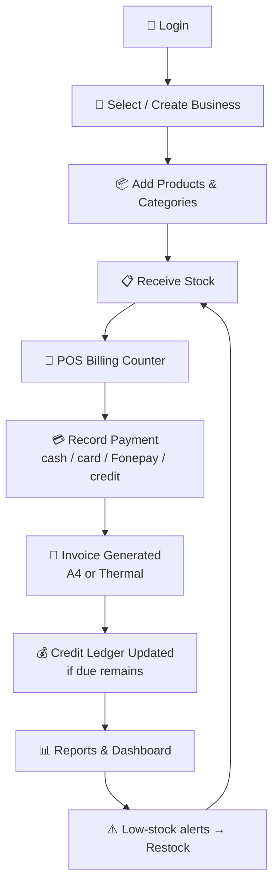
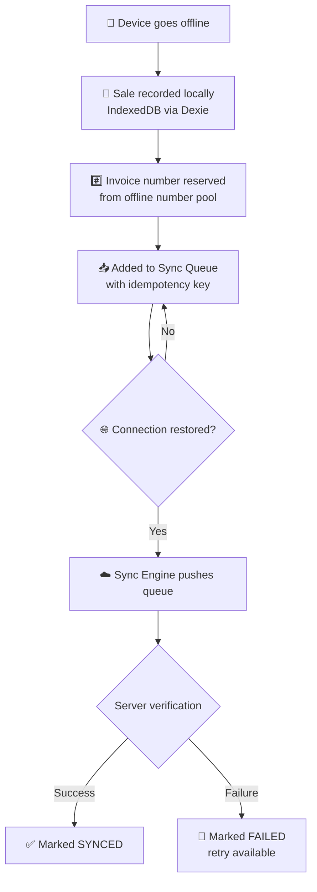

<div align="center">

# 🏪 Inventory Lite

**Simple inventory, billing, POS and customer-credit (Udharo) management for small businesses in Nepal.**

Know what you have. Know what you sold — even when the internet doesn't.

[](https://nextjs.org/)
[](https://www.typescriptlang.org/)
[](https://appwrite.io/)
[](https://developer.mozilla.org/docs/Web/Progressive_web_apps)
[](#-testing)
[](#-deployment)

[🚀 Live Demo](https://inventory-lite-saa-s-0000.vercel.app/) · [📦 Repository](https://github.com/mohit282-cpu/Inventory-Lite-SaaS-0000) · [🐛 Issues](https://github.com/mohit282-cpu/Inventory-Lite-SaaS-0000/issues)

</div>

---

## 📑 Table of Contents

- [📸 Screenshots](#-screenshots)
- [🚀 Live Demo](#-live-demo)
- [❓ What is Inventory Lite?](#-what-is-inventory-lite)
- [🎯 Who Is It For?](#-who-is-it-for)
- [✨ Core Features](#-core-features)
- [🔄 How It Works](#-how-it-works)
- [📶 Offline-First Architecture](#-offline-first-architecture)
- [🏗️ System Architecture](#️-system-architecture)
- [🔒 Security Model](#-security-model)
- [🇳🇵 Built for Nepal](#-built-for-nepal)
- [🧰 Technology Stack](#-technology-stack)
- [📂 Project Structure](#-project-structure)
- [⚡ Getting Started](#-getting-started)
- [🧪 Testing](#-testing)
- [🚢 Deployment](#-deployment)
- [📚 Documentation Map](#-documentation-map)
- [🗺️ Roadmap & Known Limitations](#️-roadmap--known-limitations)
- [🤝 Contributing](#-contributing)
- [📋 Project Status](#-project-status)

---

## 📸 Screenshots

> **Screenshots coming soon.**
>
> In the meantime, the [live demo](https://inventory-lite-saa-s-0000.vercel.app/) includes an
> interactive product walkthrough of the Dashboard, Products & Stock, POS Billing Counter and
> Tax Invoice views.

---

## 🚀 Live Demo

**URL:** <a href="https://inventory-lite-saa-s-0000.vercel.app/">https://inventory-lite-saa-s-0000.vercel.app</a>

| | |
|---|---|
| 💰 Pricing model | Free to use — no credit card or subscription required |
| 🔐 Access | The landing page is public; the application portal requires signing in / creating a free account |
| 🔄 Data persistence | Data is stored in your own Appwrite-backed account — demo availability may vary |
| ⚠️ Important | **Do not enter real production or business data** into shared/demo environments |

---

## ❓ What is Inventory Lite?

Inventory Lite is a **multi-tenant web application** that gives a small shop everything it needs to run its counter in one place: a product catalog, live stock levels, a fast point-of-sale billing screen, printable invoices, customer credit ledgers, expenses and reports.

**For the shop owner 👨‍💼**
Replace paper bill pads, Excel sheets and notebook Udharo ledgers with one app. Record a sale in a few clicks, see instantly what's left on the shelf, know exactly who owes you what, and print a proper tax invoice with your PAN/VAT details.

**For the developer 👩‍💻**
Next.js 14 App Router + TypeScript strict mode on the front, Appwrite Cloud as the backend-as-a-service, Dexie (IndexedDB) powering an offline-first POS with a sync queue, and Vitest + Playwright test suites covering security, concurrency and financial integrity. Tenant isolation is enforced at three layers — database permissions, service layer, and application RBAC.

**For the technical reviewer 🧐**
Every business record carries a `businessId`; every query is filtered by it; every read/update/delete re-verifies it (`src/services/base.service.ts`). Documents use per-user/team Appwrite permissions — never public access. The repo ships with dedicated audit docs ([TENANT_ISOLATION.md](TENANT_ISOLATION.md), [PERMISSIONS.md](PERMISSIONS.md)) and ~35 unit/integration suites plus E2E flows including offline sync.

---

## 🎯 Who Is It For?

| Business Type | Why It Helps |
|---|---|
| 🔧 Hardware shops | Track cement bags, wire rolls and fittings with SKU/barcode search and low-stock alerts |
| ⚡ Electrical shops | Fast counter billing with VAT-inclusive tax invoices |
| 🛒 Grocery & kirana stores | Quick POS entry with walk-in customers and cash/Fonepay/card payments |
| ✏️ Stationery shops | Simple catalog + categories for hundreds of small items |
| 🏬 Small retailers (general) | Customer credit (Udharo) ledger with partial payment tracking |
| 📱 Mobile-first vendors | Installable PWA that keeps working when connectivity drops |

Built specifically around how small businesses in Nepal operate — NPR currency, PAN/VAT invoicing, Bikram Sambat dates and customer credit traditions.

---

## ✨ Core Features

| Feature | Description |
|---|---|
| 🔐 **Authentication** | Email/password signup with strength meter, login, forgot/reset password, email verification with resend cooldown, offline login support |
| 🏢 **Multi-business onboarding** | Guided 3-step business setup wizard; users can belong to multiple businesses and switch between them |
| 📦 **Products & Categories** | Full CRUD with SKU auto-generation, barcodes, purchase/selling prices, units, images, minimum-stock thresholds and category organization |
| 📋 **Stock Ledger** | Stock-In / Stock-Out / Stock-Adjustment movements with reasons, movement history, low-stock banner and quick restock actions |
| 🛒 **POS Billing Counter** | Barcode/SKU scan input, catalog grid, cart controls, editable unit prices, per-line and overall discounts (Rs./%), VAT toggle (13%), change calculation, walk-in customer checkout, credit sales tied to a customer |
| 💳 **Payments** | Cash, bank transfer, card/Fonepay and other methods; paid/due split per sale |
| 👥 **Customers** | Directory with phone/address/PAN, per-customer summary, total-due tracking linked to the credit ledger |
| 💰 **Customer Credit (Udharo)** | Dedicated dues ledger with UNPAID / PARTIAL / OVERDUE / PAID filters, partial payment recording (auto-filled remaining due), payment edit/delete |
| 🧾 **Invoices & Receipts** | Auto-numbered invoices, A4 Tax Invoice ↔ 80mm thermal receipt switch, bilingual BS dates, auto-print support, print-based PDF export |
| 💸 **Expenses** | Categorized expense logging (rent, utilities, salaries, supplies, transport, maintenance…) with date filters and today/month KPIs |
| 📊 **Reports** | Sales, Product & Stock valuation (cost/retail/margin), Customer Dues, Expenses and Profit Estimate tabs — all exportable to CSV |
| 📈 **Dashboard** | Today/month sales, outstanding dues, low & out-of-stock counts, sales-trend / payment-method / top-product charts (lazy-loaded Recharts), recent activity |
| 🗓️ **Dual Calendar** | Nepal calendar with Bikram Sambat primary grid + A.D. equivalents and event tracking |
| ⚙️ **Settings & Team** | Business profile (PAN/VAT/logo/currency/timezone), password change, PWA install, Offline Sync Center, team member roles (owner/admin/staff), business danger-zone |

### 🇳🇵 Nepal-Specific Capabilities

| Capability | Details |
|---|---|
| 💵 NPR currency formatting | `Rs.` / `रु.` with Lakhs/Crores grouping |
| 🧾 PAN/VAT invoicing | Business registration numbers printed on official invoice headers |
| 📅 Bikram Sambat dates | Offline BS ↔ AD conversion (BS years 2000–2090), bilingual invoice dates |
| 🗓️ Nepali fiscal year | Financial year starting Shrawan for sequence numbering |
| ☎️ Local validation | Nepal phone number and PAN validation rules |
| 🌍 Multi-currency setting | NPR (primary), USD, INR, EUR selectable in business settings |

### 📶 Advanced: Offline Mode

Works without internet after first login — see [Offline-First Architecture](#-offline-first-architecture).

---

## 🔄 How It Works

### Daily Counter Workflow



### Offline Sale Lifecycle



---

## 📶 Offline-First Architecture

Inventory Lite is designed for shops where connectivity is unreliable:

1. **Installable PWA** — `manifest.json` + service worker (`public/sw.js`) cache the app shell for fast loads; Appwrite API requests use a strict network-first strategy so cached inventory/payment data never goes stale.
2. **Local database** — Dexie (IndexedDB) mirrors products, categories, customers, sales, payments, expenses, events and sync metadata locally.
3. **Initial sync** — on first load the `SyncEngine` downloads your business data into IndexedDB with progress feedback (`src/lib/offline/sync-engine.ts`).
4. **Offline writes** — sales/payments made offline are queued with **idempotency keys**, and invoice numbers are reserved from an **offline number pool** so numbering stays gap-safe.
5. **Reconnect sync** — the queue drains automatically when back online; failed items are marked and retryable via the Offline Sync Center in Settings.
6. **Offline authentication** — credentials are stored securely on-device after the first successful online login so staff can keep working through outages.

---

## 🏗️ System Architecture

```mermaid
flowchart LR
    subgraph Client["🌐 Browser / Installed PWA"]
        UI["Next.js 14 App Router<br/>React 18 + Tailwind + shadcn/ui"]
        SW["Service Worker<br/>app-shell cache"]
graph TD
    UI[Next.js App Router UI] --> BASE[Service Layer - BaseService]
    BASE -->|Tenant Filter & CAS Stock Lock| APPWRITE[(Appwrite Cloud Database)]
    UI -->|Offline Fallback| DEXIE[(IndexedDB Local Store)]
    DEXIE -. Offline Sync Queue .-> SYNC[Sync Engine]
    SYNC -. offline queue drain .-> DB[(Appwrite Cloud Database)]
    UI --> AUTH[Appwrite Auth & Session]
```

- **Frontend**: Next.js 14 (App Router), client-side rendered dashboard shell
- **Backend**: Appwrite Cloud (Auth, Databases, Storage) — no custom server required
- **Data access**: typed service classes extending `BaseService` (`src/services/`)
- **State**: React Context (`auth-context.tsx`) for session/business switching
- **Zero-cost design**: see [ZERO_COST_ARCHITECTURE.md](docs/architecture/ZERO_COST_ARCHITECTURE.md)

---

## 🔒 Security Model

### Three-layer tenant isolation

| Layer | Enforcement |
|---|---|
| 🗄️ Database | Per-document Appwrite permissions (`Role.user` / `Role.team`) — no public access to business data |
| ⚙️ Service | `BaseService` auto-injects `businessId` filters on every list, re-verifies ownership on every get/update/delete, and blocks `businessId` mutation |
| 🧠 Application | RBAC role checks (`src/lib/authorization.ts`) before privileged operations |

### Role hierarchy

```
Owner   → full access, incl. business deletion & role changes
Admin   → full operational access except business deletion
Staff   → day-to-day operations (POS, stock, customers)
```

### Additional hardening

- ✅ Security headers via `next.config.js`: HSTS, `X-Frame-Options: DENY`, `nosniff`, Referrer-Policy, Permissions-Policy, Content-Security-Policy
- ✅ Input validation with Zod schemas (`src/lib/validations.ts`)
- ✅ Rate limiting utilities (`src/lib/rate-limiter.ts`)
- ✅ Idempotency keys for financial writes (`src/lib/idempotency.ts`)
- ✅ Structured error taxonomy — `AppError`, `ValidationError`, `AuthenticationError`, `AuthorizationError`, etc. (`src/lib/error-handler.ts`)
- ✅ Dedicated security test suites: RBAC/tenant, P0 security, concurrency/idempotency, financial integrity

> ℹ️ This is a self-hostable project using *your own* Appwrite project. Security guarantees depend on correct configuration — follow [APPWRITE_SETUP.md](docs/APPWRITE_SETUP.md) and [PRODUCTION_CONFIGURATION_CHECKLIST.md](docs/deployment/PRODUCTION_CONFIGURATION_CHECKLIST.md).

---

## 🧰 Technology Stack

| Layer | Technology |
|---|---|
| Framework | Next.js 14 (App Router) · React 18 · TypeScript 5 (strict) |
| Styling / UI | Tailwind CSS · shadcn/ui-style components on Radix primitives · Lucide icons |
| Forms & validation | React Hook Form + Zod |
| Charts | Recharts (lazy-loaded) |
| Offline Storage | Dexie.js (IndexedDB wrapper) + custom sync engine |
| Backend | Appwrite Cloud (Auth, Databases, Storage) |
| Unit Testing | Vitest + Testing Library + fake-indexeddb |
| E2E Testing | Playwright |

---

## 📂 Project Structure

```
├── e2e/                        # Playwright E2E specs (full flow, offline POS sync)
├── scripts/
│   ├── setup-appwrite.ts       # Automated Appwrite provisioning
│   └── generate-pwa-icons.js   # PWA icon generation
├── public/                     # manifest.json, sw.js, PWA icons
├── src/
│   ├── app/
│   │   ├── auth/               # login · signup · forgot/reset password · verify email
│   │   ├── onboarding/         # 3-step business setup wizard
│   │   └── app/                # Authenticated workspace
│   │       ├── dashboard/      # KPIs & charts
│   │       ├── products/       # Catalog CRUD
│   │       ├── categories/
│   │       ├── stock/          # Stock ledger & movements
│   │       ├── sales/          # POS + sale history + receipts
│   │       ├── invoices/       # Invoice viewer (A4 / thermal)
│   │       ├── customers/
│   │       ├── credit/         # Udharo (dues) ledger
│   │       ├── payments/
│   │       ├── expenses/
│   │       ├── calendar/       # Dual BS/AD calendar
│   │       ├── reports/        # 5 report tabs + CSV export
│   │       └── settings/       # Profile · security · team/RBAC · offline sync
│   ├── components/             # ui/ · features/ · dashboard/ · landing/ · pwa/
│   ├── services/               # Typed Appwrite service layer (BaseService pattern)
│   ├── lib/
│   │   ├── offline/            # Dexie schema · SyncEngine · offline auth
│   │   └── ...                 # money · validations · authorization · rate-limiter · idempotency
│   ├── hooks/                  # use-auth · useOfflineSync · usePWAInstall
│   ├── context/                # Auth state machine incl. offline states
│   ├── config/                 # Appwrite client, collection IDs, i18n
│   └── types/                  # TypeScript definitions
└── docs/                       # Architecture, security, setup & deployment docs
```

---

## ⚡ Getting Started

### Prerequisites

- **Node.js**: v18.17+ or v20+
- **npm**: v9+
- **Appwrite Project**: free account on [cloud.appwrite.io](https://cloud.appwrite.io) (or self-hosted Appwrite instance)

### 1. Clone & install dependencies

```bash
git clone https://github.com/mohit282-cpu/Inventory-Lite-SaaS-0000.git
cd Inventory-Lite-SaaS-0000
npm install
```

### 2. Environment variables

Copy `.env.example` to `.env.local`:

```bash
cp .env.example .env.local
```

| Variable | Required | Description |
|---|---|---|
| `NEXT_PUBLIC_APPWRITE_ENDPOINT` | ✅ | Appwrite API endpoint (e.g. `https://cloud.appwrite.io/v1`) |
| `NEXT_PUBLIC_APPWRITE_PROJECT_ID` | ✅ | Your Appwrite project ID |
| `NEXT_PUBLIC_APPWRITE_DATABASE_ID` | Optional | Defaults to `inventory_lite_db` if unset |
| `APPWRITE_API_KEY` | Provisioning only | Admin API key used by `scripts/setup-appwrite.ts` — not needed at runtime |

> ⚠️ `.env.local` contains project credentials — never commit it. Only variables prefixed `NEXT_PUBLIC_` reach the browser; Appwrite Web-SDK keys are client-safe by design but scope them carefully.

### 3. Set up Appwrite

Two options — both are documented in detail in [APPWRITE_SETUP.md](docs/APPWRITE_SETUP.md):

<details>
<summary><b>Option A — Automated provisioning (recommended)</b></summary>

```bash
npx tsx scripts/setup-appwrite.ts
```

Requires an admin API key with scopes: `databases.*`, `collections.*`, `attributes.*`, `indexes.*`, `teams.*`, `users.*`. Creates the database, collections, attributes and indexes defined in [DATABASE_SCHEMA.md](docs/DATABASE_SCHEMA.md).
*(Verify the script's exact usage flags before running — requires configuration/verification.)*

</details>

<details>
<summary><b>Option B — Manual console setup</b></summary>

Create database **`inventory_lite_db`** with these collections (all enforce document security; business-owned ones carry a `businessId` key):

| Collection | Purpose |
|---|---|
| `users` | Extended user profiles |
| `businesses` | Business (tenant root) entities |
| `business_members` | Membership & roles (owner/admin/staff) |
| `categories` | Product categories |
| `products` | Product inventory |
| `stock_movements` | Stock audit logs |
| `customers` | Customer directory |
| `sales` | Sales transactions |
| `sale_items` | Line-item snapshots |
| `invoices` | Generated invoices |
| `payments` | Payment records |
| `expenses` | Expense records |
| `financial_sequences` | Fiscal-year invoice numbering |
| `audit_logs` | Audit trail (per deployment checklist) |

Plus storage buckets: `product_images`, `business_logos`, `documents`.

Full attribute/index specifications: **[DATABASE_SCHEMA.md](docs/DATABASE_SCHEMA.md)** · permission matrix: **[PERMISSIONS.md](docs/security/PERMISSIONS.md)**.

</details>

Also enable the Auth providers you need (email/password) in the Appwrite console and add your deployment domain to the allowed web platforms.

### 4. Run locally

```bash
npm run dev
# → http://localhost:3000
```

Sign up, complete the onboarding wizard, and start adding products.

### Available scripts

| Script | Purpose |
|---|---|
| `npm run dev` | Start development server |
| `npm run build` | Production build |
| `npm run start` | Serve production build |
| `npm run lint` | ESLint |
| `npm run typecheck` | TypeScript strict check (`tsc --noEmit`) |
| `npm run test` | Vitest unit/integration suite |
| `npm run test:e2e` | Playwright end-to-end suite (auto-starts dev server on :3000) |

---

## 🧪 Testing

The project ships substantial automated coverage focused on the areas where bugs cost money:

### Unit & integration (Vitest — 36 suites, jsdom + fake-indexeddb)

| Area | Suites (examples) |
|---|---|
| 🔒 Security | `security-comprehensive` · `security-rbac-tenant` · `p0-security` · `settings-rbac` · `tenant-isolation` |
| 💰 Financial integrity | `billing-calculation` · `vat-calculation-hardening` · `financial-integrity` · `financial-year-system` · `financial-year-numbering` |
| ⚡ Concurrency | `concurrency-idempotency-hardening` · `inventory-concurrency` |
| 📴 Offline | `offline-sync` · `offline-comprehensive` · `offline-distributed-sync` · `offline-payment` · `offline-auth` · `offline-session-preservation` · `offline-stock-ledger` |
| 🧩 Modules | products-categories · customers · sales-pos · invoices · credit-udha · expenses · reports · delete-business · qa-regression |
| 🇳🇵 Localization | `nepal-localization` · `nepali-calendar-system` |

```bash
npm run test            # run once
npx vitest              # watch mode
```

### End-to-end (Playwright — Chromium/Firefox/WebKit)

| Spec | Scenario |
|---|---|
| `e2e/inventory-lite-flow.spec.ts` | Core user journey through the app |
| `e2e/offline-pos-sync.spec.ts` | Offline POS sale creation and reconnect synchronization |

```bash
npm run test:e2e        # config auto-starts the dev server on :3000
npx playwright install  # first time only — download browsers
```

> The pre-deployment gate (typecheck → lint → unit tests → E2E → build) is documented in [DEPLOYMENT.md](docs/DEPLOYMENT.md). CI pipeline configuration is **not yet present** in this repository.

---

## 🚢 Deployment

The app is deployed on **Vercel** with GitHub as source control.

1. Push to the `main` branch
2. Import the repository in Vercel (framework auto-detected as Next.js)
3. Add environment variables from the table above in **Project → Settings → Environment Variables**
4. Deploy — production URL: [inventory-lite-saa-s-0000.vercel.app](https://inventory-lite-saa-s-0000.vercel.app/)

Pre-release verification steps, Appwrite production checks, index requirements and rollback procedure are documented in [DEPLOYMENT.md](docs/DEPLOYMENT.md) and [ROLLBACK_RUNBOOK.md](docs/deployment/ROLLBACK_RUNBOOK.md). A configuration checklist lives in [PRODUCTION_CONFIGURATION_CHECKLIST.md](docs/deployment/PRODUCTION_CONFIGURATION_CHECKLIST.md).

---

## 📚 Documentation Map

| Document | Contents |
|---|---|
| [DATABASE_SCHEMA.md](docs/DATABASE_SCHEMA.md) | Every collection, attribute, index and permission |
| [PERMISSIONS.md](docs/security/PERMISSIONS.md) | Role hierarchy and operation-by-operation permission matrix |
| [TENANT_ISOLATION.md](docs/architecture/TENANT_ISOLATION.md) | How multi-tenant isolation is enforced and verified |
| [APPWRITE_SETUP.md](docs/APPWRITE_SETUP.md) | Step-by-step backend provisioning guide |
| [DEPLOYMENT.md](docs/DEPLOYMENT.md) | Pre-deploy gates and production release process |
| [ROLLBACK_RUNBOOK.md](docs/deployment/ROLLBACK_RUNBOOK.md) | Incident rollback procedure |
| [ZERO_COST_ARCHITECTURE.md](docs/architecture/ZERO_COST_ARCHITECTURE.md) | How the stack runs at zero infrastructure cost |
| [AGENTS.md](AGENTS.md) | Coding standards and contribution conventions |


---

## 🗺️ Roadmap & Known Limitations

Honest status, verified against the codebase:

| Area | Status |
|---|---|
| ✅ Core inventory, POS, invoicing, credit, expenses, reports, offline sync | Implemented and tested |
| 🚧 `/admin/*` panel routes | Directories exist but **admin pages are not implemented yet** |
| 🚧 Staff invitations | Invite flow currently generates placeholder member records — not wired to real accounts yet |
| 🚧 Onboarding step-3 preferences (default VAT rate, invoice prefix, etc.) | Collected in UI but **not persisted yet** |
| 🚧 "Remember me" on login | Captured but not passed to the auth call yet |
| 🚧 Invoice PDF export | Uses the browser print dialog rather than generated PDF files |
| 🚧 Additional payment channels (eSewa/Khalti/wallets) | Supported in the data model; not exposed in the POS UI yet |
| 🚧 Continuous Integration | No CI workflow configured in this repository yet |
| ❓ License | No LICENSE file present yet — licensing terms TBD |

---

## 🤝 Contributing

Contributions are welcome!

1. Fork the repository and create a feature branch from `main`
2. Follow the coding standards in [AGENTS.md](AGENTS.md) — TypeScript strict, typed service layer, tenant isolation everywhere
3. Run the quality gate before opening a PR:
   ```bash
   npm run lint && npm run typecheck && npm run test && npm run build
   ```
4. Use conventional commit messages (`feat:`, `fix:`, `docs:`, `refactor:`, `test:`)
5. Open a pull request describing what changed and why

When touching anything data-related, double-check **tenant isolation** — every query must be scoped by `businessId`.

---

## 📋 Project Status

| | |
|---|---|
| 🟢 **Stage** | Production-oriented MVP — core flows implemented with extensive security/financial test suites |
| 🎯 **Focus market** | Small retail & wholesale businesses in Nepal |
| 💰 **Cost model** | Zero-infrastructure-cost design (Vercel free tier + Appwrite Cloud) |
| 🧪 **Quality** | 35 Vitest suites · 3 Playwright specs · security & financial-integrity audits included in-repo |
| 📄 **License** | Not yet specified — requires decision/configuration |

---

<div align="center">

**Inventory Lite** — Spend less time managing records. More time running your shop.

<a href="https://inventory-lite-saa-s-0000.vercel.app/">Start Free →</a>

Made for small businesses in Nepal 🇳🇵

</div>
