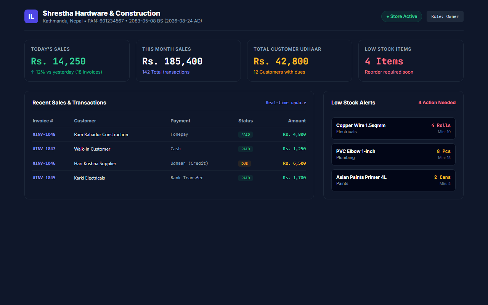
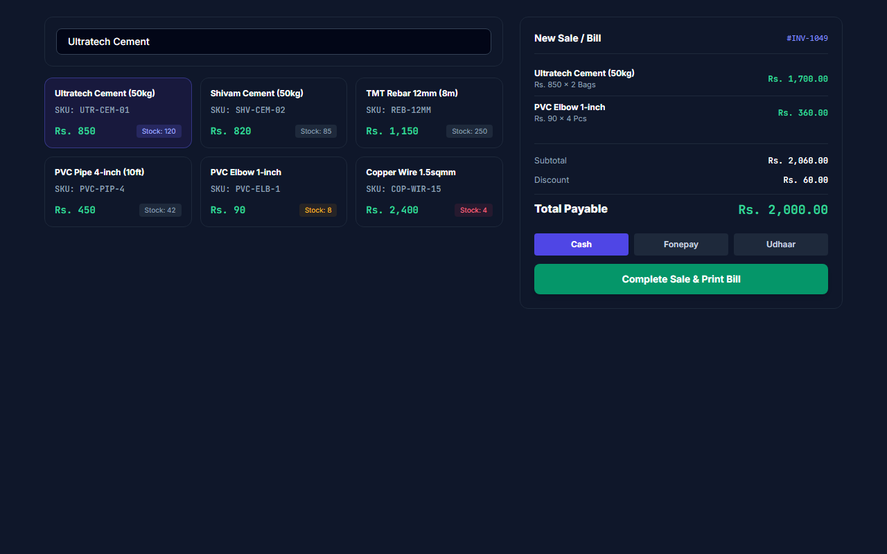
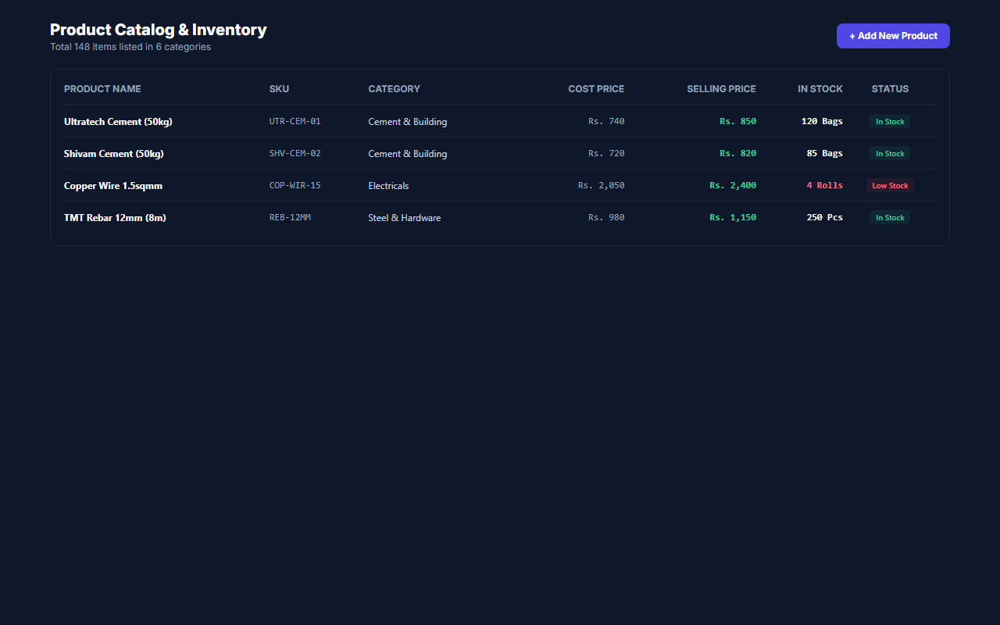
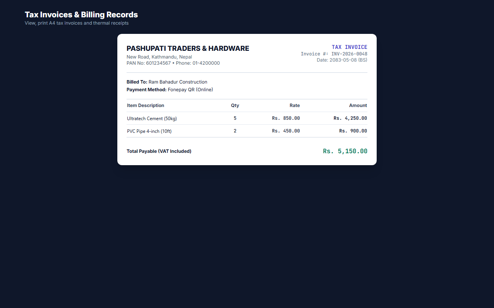
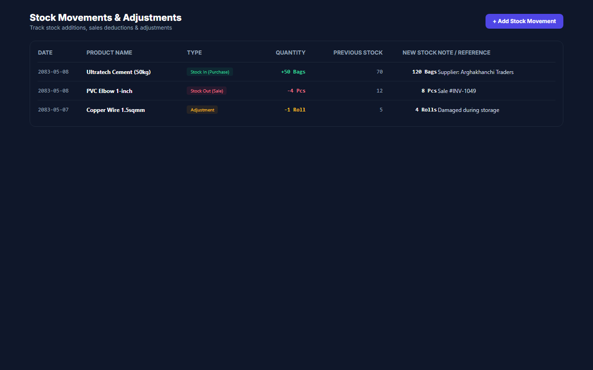
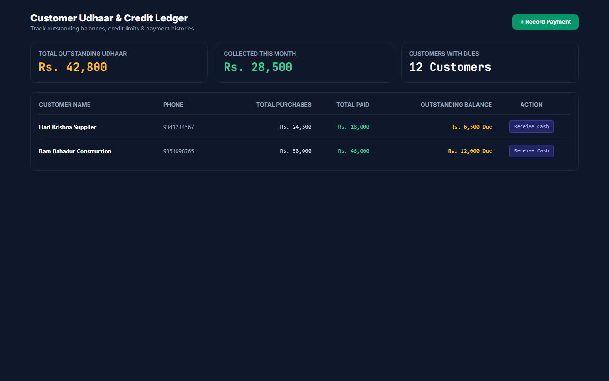
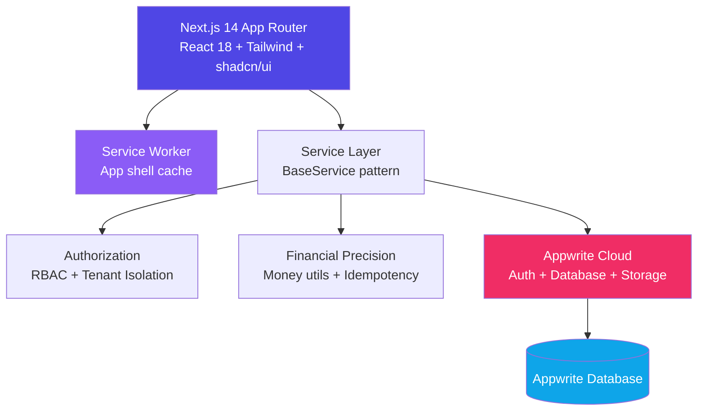

<div align="center">

# 📦 Inventory Lite

### Simple Inventory, POS Billing & Business Management for Small Businesses

> Manage products, stock, purchases, sales, customers, payments, and business
> records from one lightweight application — built for small shops in Nepal.

[](https://nextjs.org/)
[](https://www.typescriptlang.org/)
[](https://appwrite.io/)
[](https://vitest.dev/)
[](https://playwright.dev/)
[](https://vercel.com/)

[🚀 Live Demo](https://inventory-lite-saa-s-0000.vercel.app/) · [📦 Repository](https://github.com/mohit282-cpu/Inventory-Lite-SaaS-0000) · [🐛 Issues](https://github.com/mohit282-cpu/Inventory-Lite-SaaS-0000/issues)

</div>

---

## 📑 Table of Contents

- [What Is Inventory Lite?](#-what-is-inventory-lite)
- [Who Is It For?](#-who-is-it-for)
- [Why Inventory Lite?](#-why-inventory-lite)
- [Complete Feature List](#-complete-feature-list)
- [Nepal-Focused Features](#-nepal-focused-features)
- [How It Works](#-how-it-works)
- [Security](#-security)
- [Multi-Tenant Architecture](#-multi-tenant-architecture)
- [Offline Support](#-offline-support)
- [Architecture](#-architecture)
- [Technology Stack](#-technology-stack)
- [Data Model Overview](#-data-model-overview)
- [Project Structure](#-project-structure)
- [Getting Started](#-getting-started)
- [Testing](#-testing)
- [Production Build & Deployment](#-production-build--deployment)
- [Limitations & Known Issues](#-limitations--known-issues)
- [Production Readiness](#-production-readiness)
- [Future Roadmap](#-future-roadmap)
- [Contributing](#-contributing)

---

## 📸 Screenshots

| Dashboard | POS Billing | Products |
|:---------:|:-----------:|:--------:|
|  |  |  |

| Invoices | Stock Ledger | Customer Dues |
|:--------:|:------------:|:-------------:|
|  |  |  |

> Try the interactive demo on the [live application](https://inventory-lite-saa-s-0000.vercel.app/) — no signup required for the landing page walkthrough.

---

## 🚀 What Is Inventory Lite?

Inventory Lite is a **multi-tenant SaaS** that gives small shops everything they need to run their counter in one place: a product catalog, live stock levels, a fast point-of-sale billing screen, printable invoices, customer credit ledgers, supplier management, expenses, and business reports.

**For the shop owner** — Replace paper bill pads, Excel sheets, and notebook Udharo ledgers with one app. Record a sale in a few clicks, see instantly what's left on the shelf, know exactly who owes you what, and print a proper tax invoice with your PAN/VAT details.

**For the developer** — Next.js 14 App Router + TypeScript strict mode on the frontend, Appwrite Cloud as the backend-as-a-service. Typed service layer with tenant isolation, idempotency protection, and financial precision utilities. 41 Vitest test suites covering security, concurrency, and financial integrity.

---

## 🎯 Who Is It For?

| Business Type | Why It Helps |
|---|---|
| 🔧 Hardware shops | Track cement bags, wire rolls and fittings with SKU/barcode search and low-stock alerts |
| ⚡ Electrical shops | Fast counter billing with VAT-inclusive tax invoices |
| 🛒 Grocery & kirana stores | Quick POS entry with walk-in customers and cash/card payments |
| ✏️ Stationery shops | Simple catalog + categories for hundreds of small items |
| 🏬 Small retailers (general) | Customer credit (Udharo) ledger with partial payment tracking |
| 📱 Mobile-first vendors | Installable PWA that works on phones and tablets |

Built specifically around how small businesses in Nepal operate — NPR currency, PAN/VAT invoicing, Bikram Sambat dates, and customer credit traditions.

---

## 💡 Why Inventory Lite?

| Principle | What It Means |
|---|---|
| **Simple** | Not an oversized ERP. Focused on what small shops actually need. |
| **Lightweight** | Fast page loads, minimal bundle, lazy-loaded charts and dialogs. |
| **Easy to learn** | Guided onboarding wizard, familiar billing workflow. |
| **Nepal-focused** | NPR currency, BS/AD dates, PAN/VAT, fiscal year, local payment methods. |
| **Inventory + billing focused** | Product management, stock tracking, POS, invoicing, and credit — done well. |
| **Zero-infrastructure-cost** | Vercel free tier + Appwrite Cloud = no server costs to run. |

---

## 📋 Complete Feature List

### 📦 Core Inventory

| Feature | Description |
|---|---|
| Products | Full CRUD with name, SKU, barcode, purchase price, selling price, unit, image, category |
| SKU Auto-generation | Automatic unique SKU assignment for products |
| Barcode Support | Barcode/QR code scanning and lookup in POS |
| Categories | Product categorization with name and description |
| Stock Quantity | Real-time stock tracking per product |
| Low Stock Alerts | Configurable minimum stock threshold with alerts |
| Product Images | Image upload via Appwrite Storage buckets |
| Product Status | Active/inactive toggle for soft-delete |
| Search & Filter | Product search by name, SKU, or barcode |

### 📥 Purchases

| Feature | Description |
|---|---|
| Purchase Orders | Create purchases linked to suppliers with line items |
| Supplier Invoice Number | Record the supplier's own invoice/bill number |
| Line Items | Per-item quantity, purchase price, discount, tax |
| Subtotal/Discount/Tax/Total | Full financial breakdown |
| Payment Tracking | Paid amount, due amount, payment method |
| Purchase History | Searchable and filterable purchase list |
| Stock IN | Automatic stock increment on purchase completion |
| Purchase Cancellation | Cancel purchases with stock reversal |
| Supplier Balance | Automatic outstanding payable update |

### 🧑‍💼 Suppliers

| Feature | Description |
|---|---|
| Supplier Directory | Create, edit, and archive suppliers |
| Contact Information | Name, phone, email, address |
| PAN/VAT Number | Combined tax registration field |
| Purchase History | View all purchases from a supplier |
| Outstanding Payable | Running balance of amounts owed |
| Supplier Payments | Record payments to suppliers with amount, method, date, reference |
| Supplier Ledger | Full transaction history with running balance |
| Archive/Restore | Soft-delete and restore suppliers |

### 🛒 POS Billing

| Feature | Description |
|---|---|
| Product Search | Search by name in the POS catalog grid |
| Barcode/SKU Input | Scan or type barcode/SKU for quick product lookup |
| Cart Management | Add, remove, adjust quantity with +/- controls |
| Editable Unit Prices | Override selling price per line item |
| Per-line Discounts | Discount amount per cart item |
| Overall Discount | Rs. or percentage discount on the entire sale |
| VAT Toggle | Enable/disable 13% VAT per transaction |
| Payment Methods | Cash, bank transfer, card, credit (Udharo) |
| Walk-in Customers | Checkout without assigning a customer |
| Credit Sales | Assign customer and create due amount |
| Invoice Generation | Auto-numbered invoice created on sale completion |
| Receipt Printing | Print-optimized layout for POS receipts |

### 🧾 Invoices

| Feature | Description |
|---|---|
| Sequential Numbering | FY-based invoice numbers (e.g. `INV-83/84-000001`) |
| Invoice Detail | Customer info, line items, totals, payment status |
| A4 Tax Invoice | Full-page tax invoice layout with business details |
| Thermal Receipt | 80mm/58mm thermal receipt format for POS printers |
| Print Support | `window.print()` with print-optimized CSS |
| BS Date Display | Bilingual BS + AD dates on invoices |
| Invoice History | Searchable list of all invoices |
| Invoice Number per Fiscal Year | Numbering resets per Nepal fiscal year |

### 🔄 Sales Returns

| Feature | Description |
|---|---|
| Return Processing | Full or partial returns against original sale |
| Item Selection | Select specific items and quantities to return |
| Return Quantity Validation | Cannot return more than originally sold (minus prior returns) |
| Stock Restoration | Automatic stock increment on return completion |
| Refund Methods | Cash, credit adjustment, bank transfer, digital wallet, other |
| Return Reason | Required text reason for each return |
| Financial Adjustment | Subtotal, discount, tax, total calculated for return |
| Return History | Searchable list of all returns |

### 📝 Credit Notes

| Feature | Description |
|---|---|
| Credit Note Number | Sequential FY-based numbering |
| Linked to Invoice | References the original invoice and sale |
| Customer Association | Auto-populated from invoice |
| Reason | Required text reason for issuance |
| VAT Adjustment | Taxable amount and 13% VAT calculated |
| Customer Due Adjustment | Optional automatic reduction of customer outstanding |
| Audit Trail | Created by, timestamp, full record |

### 📝 Debit Notes

| Feature | Description |
|---|---|
| Debit Note Number | Sequential FY-based numbering |
| Linked to Purchase | References the original purchase |
| Supplier Association | Auto-populated from purchase |
| Reason | Required text reason for issuance |
| VAT Adjustment | Taxable amount and 13% VAT calculated |
| Supplier Balance Adjustment | Optional automatic reduction of supplier outstanding |
| Audit Trail | Created by, timestamp, full record |

### 👥 Customers

| Feature | Description |
|---|---|
| Customer Directory | Create and manage customer records |
| Contact Details | Name, phone, email, address |
| Purchase History | View all sales linked to a customer |
| Outstanding Balance | Running `totalDue` field |
| Customer Detail Page | Full customer view with transactions |
| Walk-in Support | Sales can proceed without a customer record |

### 🤝 Udharo (Customer Credit)

| Feature | Description |
|---|---|
| Credit Ledger | Dedicated page showing all customers with outstanding dues |
| Status Filters | UNPAID, PARTIAL, OVERDUE, PAID, ALL |
| Customer Filter | Filter by specific customer |
| Summary KPIs | Total credit due, customers with credit, overdue amount, payments this month |
| Record Payment | Dialog to record partial or full payment against due |
| Payment Edit/Delete | Modify or remove previously recorded payments |
| Auto-filled Remaining | When recording payment, remaining due auto-calculated |
| Customer Details Drawer | Slide-out panel with full credit history |

### 💳 Payments

| Feature | Description |
|---|---|
| Cash | Standard cash payment |
| Bank Transfer | Bank/wire transfer recording |
| Card | Card payment recording |
| Credit | Udharo/credit payment (creates due amount) |
| Payment History | Full payment records per sale |
| Payment Status | POSTED, VOIDED, REVERSED, REFUNDED |
| Payment Reversal | Void or reverse payments with status tracking |

### 💸 Expenses

| Feature | Description |
|---|---|
| Expense Logging | Title, category, description, amount, date, notes |
| Categories | Free-text categories (rent, utilities, salaries, supplies, transport, maintenance) |
| Date Filters | Filter expenses by date range |
| Today/Month KPIs | Today's expenses, this month's total, all-time total |
| Expense History | Searchable list of all expenses |

### 📊 Reports

| Feature | Description |
|---|---|
| Sales Register | Filterable table of all sales with search, status filter, totals |
| Product & Stock Valuation | Inventory value at cost and retail, margin calculations |
| Customer Dues Report | Outstanding balances by customer |
| Expense Report | Expense breakdown by category |
| Profit Estimate | Revenue, COGS, gross/net profit, margin percentage |
| Tax/VAT Summary | Output VAT (sales), Input VAT (purchases), credit/debit note adjustments, net VAT position |
| Purchase Register | Filterable table of all purchases with supplier, totals |
| Monthly Financial Summary | Grouped bar chart: Revenue, Expenses, Net Profit per month |
| Business Health Audit | Payment variances, duplicate invoices, sequence gaps |
| Financial Year Selector | BS fiscal year filtering for all reports |
| Two View Modes | Simple (shop owner) and Accountant (detailed) views |
| Export | CSV, Excel (9-sheet workbook), PDF, ZIP Audit Pack |

### 📈 Dashboard

| Feature | Description |
|---|---|
| KPI Cards | Today's sales, monthly sales, outstanding dues, low/out-of-stock counts |
| Sales Trend Chart | 7-day area chart with gradient fill (Recharts) |
| Payment Methods Chart | Donut/pie chart showing Cash/Card/Credit breakdown |
| Top Products Chart | Horizontal bar chart of top-selling products by revenue |
| Recent Activity | Latest transactions feed |
| Lazy-loaded Charts | Code-split via `next/dynamic` for performance |

### 📚 Stock Movement

| Feature | Description |
|---|---|
| Stock IN | Manual stock addition with reason |
| Stock OUT | Manual stock removal with reason |
| Stock Adjustment | Correct stock quantity with reason |
| Movement History | Full audit trail with date/time, type, product, quantities |
| Previous/New Quantity | Each movement records before and after stock levels |
| Reference Links | Movements linked to sales, purchases, or returns |
| Date Presets | Today, Yesterday, This Week, This Month, Last Month, All, Custom |
| PDF Export | A4 Landscape stock ledger PDF with 9 columns |

### 📊 Export & PDF

| Feature | Description |
|---|---|
| CSV Export | Sales, invoices, expenses with proper escaping |
| Excel Export | 9-sheet workbook via SheetJS: Executive Summary, Monthly Summary, Sales Register, Invoice Register, Payment Reconciliation, Receivables, Inventory, Expenses, Cancelled Transactions |
| PDF Export | Stock ledger PDF (A4 Landscape, 9 columns), Business Intelligence PDF (Executive Summary, Sales Register, Payment Reconciliation) |
| Audit Pack (ZIP) | Bundles Excel + PDF into a single ZIP download |
| Print | Browser print with thermal (58mm/80mm) and A4 layouts |

### 👤 Staff & RBAC

| Feature | Description |
|---|---|
| Owner | Full access including business deletion and role changes |
| Admin | Full operational access except business deletion |
| Staff | Day-to-day operations: POS, stock reading, customer reading, creating sales/payments |
| Permission Matrix | Documented per-role permission list enforced at service layer |
| Team Settings | View and manage team members (owner/admin only) |

---

## 🇳🇵 Nepal-Focused Features

### NPR Currency

Nepalese Rupee formatting with `Rs.` / `रु.` prefix and Lakhs/Crores grouping. Used throughout invoices, receipts, reports, and dashboards.

### Bikram Sambat (BS) Dates

Offline BS ↔ AD conversion engine supporting years 2000–2090 BS. Bilingual date display (English and Nepali). BS date picker component. Used in all date displays, invoices, and reports.

### PAN / VAT

Business PAN and VAT registration fields on the business profile. PAN/VAT numbers printed on invoice headers. 13% VAT calculation on sales and purchases.

### Fiscal Year

Nepal fiscal year starting on Shrawan 1st (BS Month 4). Document numbers labeled per fiscal year (e.g. `2083/84`). Sequential numbering resets each fiscal year.

### Invoice Numbering

Sequential FY-based numbering for invoices, sales, purchases, sales returns, credit notes, and debit notes. Format: `{PREFIX}-{FY}-{SEQUENCE}` (e.g. `INV-83/84-000001`).

### Tax Records

Sales register, purchase register, and tax/VAT summary reports designed for Nepal tax record-keeping. System-generated summary with disclaimer that it does not constitute an official IRD filing.

---

## 🔒 Security

### Authentication

- Email/password signup with password strength meter
- Login with session management
- Forgot/reset password flow
- Email verification with resend cooldown
- Account status tracking (ACTIVE/BLOCKED)

### Role-Based Access Control (RBAC)

Three-tier role hierarchy enforced at the service layer:

```
Owner   → full access, incl. business deletion & role changes
Admin   → full operational access except business deletion
Staff   → day-to-day operations (POS, stock reading, sales creation)
```

Every service call goes through `authorizeBusinessAccess()` which:
1. Validates user authentication
2. Blocks client code from passing `businessId = 'system'`
3. Resolves the caller's real role from the database membership record
4. Checks required role against resolved role

### Tenant Isolation

Three-layer isolation:

| Layer | Enforcement |
|---|---|
| **Database** | Per-document Appwrite permissions — no public access to business data |
| **Service** | `BaseService` auto-injects `businessId` filters on every query, re-verifies ownership on every operation |
| **Application** | RBAC role checks before privileged operations |

### Financial Protection

- **Idempotency keys** for financial writes (prevents duplicate transactions across retries)
- **CAS stock locks** for inventory operations (prevents overselling under concurrency)
- **Financial invariant validation** (paid ≤ total, due = total - paid, no negative amounts)
- **Invoice immutability** — sale items are snapshotted at time of sale (product names, prices frozen)
- **Payment reversal tracking** — payments can be VOIDED or REVERSED, never silently deleted

### Security Headers

Configured in `next.config.js`:

- `Strict-Transport-Security` (HSTS with preload)
- `X-Frame-Options: DENY`
- `X-Content-Type-Options: nosniff`
- `Referrer-Policy: strict-origin-when-cross-origin`
- `Permissions-Policy` (camera, microphone, geolocation disabled)
- `Content-Security-Policy` (restricted origins)

### Input Validation

All user inputs validated with Zod schemas (`src/lib/validations.ts`). Financial values validated for NaN, Infinity, negative amounts. File upload validation checks extensions, magic bytes, and path traversal.

### Error Handling

Structured error taxonomy: `AppError`, `ValidationError`, `AuthenticationError`, `AuthorizationError`, `NotFoundError`, `NetworkError`. User-friendly messages with technical details logged for debugging.

---

## 🏢 Multi-Tenant Architecture

```
User
  └─→ Business
        └─→ BusinessMembership
              └─→ Role (owner / admin / staff)
                    └─→ Business Data (products, sales, invoices, etc.)
```

Every business record carries a `businessId` field. Every query is filtered by it. Every read/update/delete re-verifies it.

**Key files:**
- `src/services/base.service.ts` — Abstract CRUD with automatic `businessId` injection
- `src/lib/authorization.ts` — RBAC permission matrix and `authorizeBusinessAccess()`
- `src/lib/security.ts` — `ForbiddenError`, `validateTenantAccess()`, `buildAppwritePermissions()`

---

## 📴 Offline Support

Inventory Lite includes a **Progressive Web App (PWA)** with offline capabilities:

### What Works Offline

- **App shell** — Service Worker (`public/sw.js`) caches static assets for fast loads
- **Offline detection** — Amber banner displayed when connection is lost
- **BS/AD calendar** — 100% offline date conversion engine (no network required)
- **Cached pages** — Previously visited pages available from cache

### How It Works

1. **Service Worker** caches the app shell on install (manifest, icons, favicon, root page)
2. **Static assets** served cache-first with background network update
3. **API requests** (Appwrite database/account/storage) use strict network-first strategy — returns 503 JSON offline error if unavailable
4. **Offline banner** shows in the app layout when `navigator.onLine` is false

### Limitations

- The service worker handles **app shell caching only** — it does not cache API responses
- There is no client-side data persistence layer (IndexedDB/Dexie) for offline sales or data sync in the current codebase
- Sales and other writes require an active connection to Appwrite
- The offline mode prevents app loading failures but does not enable offline data entry

---

## 🏗️ Architecture



### Data Flow

```
User Action → Next.js Page → Service Method
  → authorizeBusinessAccess() (RBAC + tenant check)
  → BaseService query (businessId filter)
  → Appwrite SDK call
  → Response validation
  → UI Update
```

### Key Design Decisions

| Decision | Rationale |
|---|---|
| Appwrite as BaaS | Zero server infrastructure, built-in auth/database/storage |
| Typed service layer | Type safety from UI to database, easy to test |
| BaseService pattern | DRY — tenant isolation and CRUD in one place |
| Client-side rendering | Faster initial loads, offline shell resilience |
| Lazy-loaded charts | Smaller initial bundle, faster TTI |
| Financial precision (paisa) | Integer minor units eliminate floating-point errors |

---

## 🧰 Technology Stack

| Layer | Technology |
|---|---|
| Framework | Next.js 14 (App Router) · React 18 · TypeScript 5 (strict) |
| Styling / UI | Tailwind CSS · shadcn/ui-style components on Radix primitives · Lucide icons |
| Forms & Validation | React Hook Form + Zod |
| Charts | Recharts (lazy-loaded via `next/dynamic`) |
| PDF Generation | jsPDF + jspdf-autotable |
| Excel Export | SheetJS (xlsx) |
| ZIP Bundling | JSZip |
| Backend | Appwrite Cloud (Auth, Databases, Storage) |
| Unit Testing | Vitest + Testing Library + fake-indexeddb |
| E2E Testing | Playwright (Chromium, Firefox, WebKit) |
| Deployment | Vercel (frontend) · GitHub (source control) |

---

## 📊 Data Model Overview

### Appwrite Collections (22)

| Collection | Purpose |
|---|---|
| `users` | Extended user profiles |
| `businesses` | Business (tenant root) entities |
| `business_members` | Membership & roles |
| `categories` | Product categories |
| `products` | Product inventory |
| `stock_movements` | Stock audit trail |
| `customers` | Customer directory |
| `sales` | Sales transactions |
| `sale_items` | Line-item snapshots |
| `invoices` | Generated invoices |
| `payments` | Payment records |
| `expenses` | Expense records |
| `financial_sequences` | FY-based document numbering |
| `inventory_locks` | Distributed locking for SKU/barcode uniqueness |
| `idempotency_keys` | Idempotency keys for financial writes |
| `suppliers` | Supplier/vendor directory |
| `purchases` | Purchase orders |
| `purchase_items` | Purchase line items |
| `supplier_payments` | Payments to suppliers |
| `sales_returns` | Sales return records |
| `sales_return_items` | Return line items |
| `credit_notes` | Credit notes issued to customers |
| `debit_notes` | Debit notes issued to suppliers |

### Storage Buckets (3)

| Bucket | Purpose |
|---|---|
| `product_images` | Product images |
| `business_logos` | Business logos |
| `documents` | General document uploads |

### Key Relationships

```
Business ──1:N──→ Products ──1:N──→ StockMovements
Business ──1:N──→ Customers ──1:N──→ Sales ──1:N──→ SaleItems
                                  ├──1:N──→ Payments
                                  └──1:1──→ Invoices
Business ──1:N──→ Suppliers ──1:N──→ Purchases ──1:N──→ PurchaseItems
                                            └──1:N──→ SupplierPayments
Sales ──1:N──→ SalesReturns ──1:N──→ SalesReturnItems
Invoices ──1:N──→ CreditNotes
Purchases ──1:N──→ DebitNotes
Business ──1:N──→ Expenses
Business ──1:N──→ FinancialSequences
```

---

## 📂 Project Structure

```
inventory-lite-saas/
├── e2e/                              # Playwright E2E specs
├── docs/                             # Architecture, security, deployment docs
│   ├── APPWRITE_SETUP.md
│   ├── DATABASE_SCHEMA.md
│   ├── DEPLOYMENT.md
│   ├── architecture/
│   │   ├── TENANT_ISOLATION.md
│   │   └── ZERO_COST_ARCHITECTURE.md
│   ├── deployment/
│   │   ├── PRODUCTION_CONFIGURATION_CHECKLIST.md
│   │   └── ROLLBACK_RUNBOOK.md
│   └── security/
│       └── PERMISSIONS.md
├── public/
│   ├── manifest.json                 # PWA manifest
│   ├── sw.js                         # Service worker
│   ├── icons/                        # PWA icons
│   └── screenshots/                  # App screenshots
├── scripts/
│   ├── setup-appwrite.ts             # Automated Appwrite provisioning
│   └── generate-pwa-icons.js         # PWA icon generation
├── src/
│   ├── app/
│   │   ├── layout.tsx                # Root layout (fonts, providers)
│   │   ├── page.tsx                  # Landing page
│   │   ├── globals.css
│   │   ├── auth/                     # login · signup · forgot/reset · verify
│   │   ├── onboarding/               # 3-step business setup wizard
│   │   └── app/                      # Authenticated workspace
│   │       ├── layout.tsx            # App shell (sidebar, nav, offline banner)
│   │       ├── dashboard/            # KPIs & charts
│   │       ├── products/             # Product catalog CRUD
│   │       ├── categories/           # Category management
│   │       ├── stock/                # Stock ledger & movements
│   │       ├── sales/                # POS + sale history + receipts
│   │       │   ├── new/              # POS billing counter
│   │       │   └── [id]/             # Sale detail
│   │       ├── invoices/             # Invoice viewer (A4 / thermal)
│   │       │   └── [id]/             # Invoice detail
│   │       ├── customers/            # Customer directory
│   │       │   └── [id]/             # Customer detail
│   │       ├── credit/               # Udharo (dues) ledger
│   │       ├── purchases/            # Purchase order management
│   │       ├── suppliers/            # Supplier directory
│   │       ├── expenses/             # Expense tracking
│   │       ├── calendar/             # Dual BS/AD calendar
│   │       ├── reports/              # Reports with export
│   │       └── settings/             # Profile · security · team · offline
│   ├── components/
│   │   ├── ui/                       # Base UI components (26 files)
│   │   ├── features/                 # Business feature components
│   │   │   ├── categories/
│   │   │   ├── credit/
│   │   │   ├── customers/
│   │   │   ├── expenses/
│   │   │   ├── invoices/
│   │   │   ├── products/
│   │   │   ├── purchases/
│   │   │   ├── reports/              # 20+ report components
│   │   │   ├── sales/
│   │   │   ├── settings/
│   │   │   ├── stock/
│   │   │   └── suppliers/
│   │   ├── auth/                     # Auth guard, loading, error screens
│   │   ├── dashboard/                # Recharts dashboard components
│   │   ├── demo/                     # Interactive demo components
│   │   ├── landing/                  # Landing page sections (15+)
│   │   ├── layout/                   # Sidebar, top-nav, mobile-nav
│   │   └── pwa/                      # SW register, install prompt
│   ├── services/                     # Typed Appwrite service layer (25 files)
│   │   ├── base.service.ts           # Abstract CRUD with tenant isolation
│   │   ├── auth.service.ts
│   │   ├── product.service.ts        # CAS stock lock
│   │   ├── sale.service.ts           # Transaction with compensating rollback
│   │   ├── invoice.service.ts
│   │   ├── purchase.service.ts
│   │   ├── supplier.service.ts
│   │   ├── customer.service.ts
│   │   ├── expense.service.ts
│   │   ├── analytics.service.ts      # Dashboard metrics, P&L
│   │   ├── stock-movement.service.ts
│   │   ├── sales-return.service.ts
│   │   ├── credit-note.service.ts
│   │   ├── debit-note.service.ts
│   │   ├── payment.service.ts
│   │   ├── supplier-payment.service.ts
│   │   ├── numbering.service.ts      # Atomic FY sequence numbering
│   │   ├── calendar.service.ts       # BS↔AD conversion
│   │   └── ...                       # audit-log, business-member, etc.
│   ├── lib/
│   │   ├── utils.ts                  # cn(), formatCurrency, etc.
│   │   ├── money.ts                  # Financial precision (paisa minor units)
│   │   ├── validations.ts            # Zod schemas for all entities
│   │   ├── authorization.ts          # RBAC permission matrix
│   │   ├── security.ts               # ForbiddenError, sanitize, file validation
│   │   ├── error-handler.ts          # Structured error taxonomy
│   │   ├── idempotency.ts            # Two-tier idempotency (in-memory + persistent)
│   │   ├── rate-limiter.ts           # Rate limiting utilities
│   │   ├── financial-year.ts         # Nepal FY logic (Shrawan 1 start)
│   │   ├── localization.ts           # i18n helpers
│   │   ├── report-auditor.ts         # Business health analyzer
│   │   ├── nepali-calendar-data.ts   # BS lookup tables (2000-2090)
│   │   ├── calendar-settings.ts      # Calendar configuration
│   │   ├── export-records.ts         # Record export orchestration
│   │   ├── async-utils.ts            # Async utility helpers
│   │   ├── date/
│   │   │   └── bs-date.ts            # BS↔AD conversion engine
│   │   ├── export/
│   │   │   ├── csv-export.ts
│   │   │   ├── excel-export.ts       # 9-sheet workbook
│   │   │   └── pdf-export.ts         # BI PDF generation
│   │   └── pdf/
│   │       └── stock-ledger-pdf.ts   # Stock ledger PDF
│   ├── hooks/
│   │   ├── use-auth.ts
│   │   ├── use-debounce.ts
│   │   └── usePWAInstall.ts
│   ├── context/
│   │   ├── auth-context.tsx          # Session state machine
│   │   └── language-context.tsx      # Language/i18n context
│   ├── config/
│   │   ├── appwrite.ts               # Client, DATABASE_ID, COLLECTIONS, BUCKETS
│   │   └── i18n.ts                   # Internationalization config
│   ├── locales/
│   │   ├── en.ts                     # English locale
│   │   └── ne.ts                     # Nepali locale
│   ├── types/
│   │   └── index.ts                  # All TypeScript type definitions
│   └── test/                         # 41 Vitest test suites
├── .env.example                      # Environment template
├── next.config.js                    # Security headers, Appwrite domains
├── tailwind.config.ts                # shadcn/ui theme tokens
├── tsconfig.json                     # TypeScript strict mode
├── vitest.config.mts                 # Vitest configuration
├── playwright.config.ts              # Playwright configuration
├── package.json
└── AGENTS.md                         # Coding standards & guidelines
```

---

## ⚡ Getting Started

### Prerequisites

- **Node.js**: v18.17+ or v20+
- **npm**: v9+
- **Appwrite Project**: Free account on [cloud.appwrite.io](https://cloud.appwrite.io) (or self-hosted)

### 1. Clone & Install

```bash
git clone https://github.com/mohit282-cpu/Inventory-Lite-SaaS-0000.git
cd Inventory-Lite-SaaS-0000
npm install
```

### 2. Environment Variables

```bash
cp .env.example .env.local
```

| Variable | Required | Description |
|---|---|---|
| `NEXT_PUBLIC_APPWRITE_ENDPOINT` | Yes | Appwrite API endpoint (e.g. `https://cloud.appwrite.io/v1`) |
| `NEXT_PUBLIC_APPWRITE_PROJECT_ID` | Yes | Your Appwrite project ID |
| `NEXT_PUBLIC_APPWRITE_DATABASE_ID` | No | Defaults to `inventory_lite_db` if unset |
| `APPWRITE_API_KEY` | Provisioning only | Admin API key for `scripts/setup-appwrite.ts` — not needed at runtime |

> `.env.local` contains project credentials — never commit it. Only `NEXT_PUBLIC_` variables reach the browser.

### 3. Set Up Appwrite

**Option A — Automated provisioning (recommended):**

```bash
npx tsx scripts/setup-appwrite.ts
```

Requires an admin API key with scopes: `databases.*`, `collections.*`, `attributes.*`, `indexes.*`, `teams.*`, `users.*`. See [APPWRITE_SETUP.md](docs/APPWRITE_SETUP.md) for details.

**Option B — Manual console setup:**

Create database `inventory_lite_db` with 22 collections and 3 storage buckets. Full schema: [DATABASE_SCHEMA.md](docs/DATABASE_SCHEMA.md). Permission matrix: [PERMISSIONS.md](docs/security/PERMISSIONS.md).

### 4. Run Locally

```bash
npm run dev
# → http://localhost:3000
```

Sign up, complete the onboarding wizard, and start adding products.

### Available Scripts

| Script | Purpose |
|---|---|
| `npm run dev` | Start development server |
| `npm run build` | Production build |
| `npm run start` | Serve production build |
| `npm run lint` | ESLint |
| `npm run typecheck` | TypeScript strict check (`tsc --noEmit`) |
| `npm run test` | Vitest unit/integration suite |
| `npm run test:e2e` | Playwright end-to-end suite |
| `npm run clean` | Remove `.next/` build cache |

---

## 🧪 Testing

### Unit & Integration (Vitest — 41 suites)

Run in `jsdom` environment with `fake-indexeddb` for IndexedDB mocking.

| Category | Test Suites |
|---|---|
| 🔒 Security (5) | `security-comprehensive` · `security-rbac-tenant` · `p0-security` · `settings-rbac` · `tenant-isolation` |
| 💰 Financial (5) | `billing-calculation` · `vat-calculation-hardening` · `financial-integrity` · `financial-year-system` · `financial-year-numbering` |
| ⚡ Concurrency (2) | `concurrency-idempotency-hardening` · `inventory-concurrency` |
| 🧩 Modules (11) | `products-categories` · `customers` · `sales-pos` · `invoices` · `credit-udha` · `credit-notes` · `debit-notes` · `expenses` · `reports` · `purchases-suppliers` · `sales-returns` |
| 📊 Reports & Audit (3) | `reports` · `reports-business-intelligence-audit` · `registers-tax` |
| 📚 Stock (2) | `stock-management` · `stock-ledger-pdf` |
| 🇳🇵 Localization (3) | `nepal-localization` · `nepali-calendar-system` · `bs-date-system` |
| 🏢 Business (4) | `delete-business` · `onboarding-flow-step3` · `business-tax-registration` · `persistent-multi-device-business` |
| 🔐 Auth (2) | `auth-flow` · `auth-bootstrap-hang` |
| 📋 Other (4) | `bill-cancellation` · `cogs-profit` · `qa-edge-cases` · `qa-fixes-regression` · `utils` |

```bash
npm run test            # run once
npx vitest              # watch mode
```

### End-to-End (Playwright — 3 browsers)

| Spec | Scenario |
|---|---|
| `e2e/example.spec.ts` | Homepage load and navigation |
| `e2e/inventory-lite-flow.spec.ts` | Landing page navigation and auth route rendering |

```bash
npm run test:e2e        # auto-starts dev server on :3000
npx playwright install  # first time only — download browsers
```

---

## 🚀 Production Build & Deployment

### Production Build

```bash
npm run typecheck && npm run lint && npm run test && npm run build
```

### Deployment (Vercel)

1. Push to the `main` branch
2. Import the repository in Vercel (framework auto-detected as Next.js)
3. Add environment variables in **Project → Settings → Environment Variables**
4. Deploy

Production URL: [inventory-lite-saa-s-0000.vercel.app](https://inventory-lite-saa-s-0000.vercel.app/)

### Production Configuration

- Security headers configured in `next.config.js`
- Source maps disabled in production (`productionBrowserSourceMaps: false`)
- SWC minification enabled
- See [DEPLOYMENT.md](docs/DEPLOYMENT.md) for pre-deploy gates
- See [PRODUCTION_CONFIGURATION_CHECKLIST.md](docs/deployment/PRODUCTION_CONFIGURATION_CHECKLIST.md) for deployment checklist
- See [ROLLBACK_RUNBOOK.md](docs/deployment/ROLLBACK_RUNBOOK.md) for incident rollback

---

## ⚠️ Limitations & Known Issues

| Area | Status |
|---|---|
| Offline data entry | Service Worker caches the app shell only; sales and writes require an active connection. No IndexedDB/Dexie data sync layer exists in the current codebase. |
| Staff invitations | Invite flow generates placeholder member records — not wired to real accounts yet. |
| Onboarding step-3 preferences | Default VAT rate, invoice prefix, etc. are collected in UI but not persisted yet. |
| eSewa/Khalti payments | Supported in the data model (`PaymentMethod` type) but not exposed in the POS UI yet. |
| Admin panel | Route directories exist but admin pages are not implemented. |
| CI/CD pipeline | No GitHub Actions or CI workflow configured. |
| Invoice PDF | Uses browser print dialog rather than server-generated PDF files. |
| License | No LICENSE file present — licensing terms TBD. |

---

## ✅ Production Readiness

### What Exists

- Typed service layer with tenant isolation on every operation
- RBAC enforced at the service layer (not just the UI)
- Financial precision utilities (integer minor units / paisa)
- Idempotency keys preventing duplicate financial transactions
- CAS stock locks preventing overselling under concurrency
- Invoice immutability (snapshotted line items)
- Payment reversal tracking (VOIDED/REVERSED status)
- Structured error handling taxonomy
- Security headers (HSTS, CSP, X-Frame-Options, etc.)
- Input validation with Zod schemas
- 41 Vitest test suites covering security, financial integrity, and concurrency
- PWA with service worker for app shell caching

### What Needs Work

- Offline data sync and conflict resolution
- CI/CD pipeline
- Real-time notifications
- Multi-currency exchange rates
- Barcode scanning via camera
- Multi-language invoice printing
- Audit log UI
- Data backup/restore
- Rate limiting in production
- LICENSE file

---

## 🗺️ Future Roadmap

| Priority | Feature |
|---|---|
| High | Offline data sync with conflict resolution (IndexedDB/Dexie) |
| High | CI/CD pipeline (GitHub Actions) |
| High | Real staff invitation flow with email verification |
| Medium | eSewa/Khalti payment integration in POS UI |
| Medium | Admin panel for platform management |
| Medium | Camera-based barcode scanning |
| Medium | Multi-language invoice printing (Nepali/English) |
| Medium | Audit log viewer in settings |
| Low | Data backup and restore |
| Low | Multi-currency exchange rate support |
| Low | Real-time notifications (stock alerts, payment reminders) |
| Low | Android wrapper (Capacitor/TWA) |

---

## 🤝 Contributing

1. Fork the repository and create a feature branch from `main`
2. Follow the coding standards in [AGENTS.md](AGENTS.md) — TypeScript strict, typed service layer, tenant isolation everywhere
3. Run the quality gate before opening a PR:
   ```bash
   npm run lint && npm run typecheck && npm run test && npm run build
   ```
4. Use conventional commit messages (`feat:`, `fix:`, `docs:`, `refactor:`, `test:`)
5. Open a pull request describing what changed and why

When touching anything data-related, double-check **tenant isolation** — every query must be scoped by `businessId`.

---

## 📚 Documentation

| Document | Contents |
|---|---|
| [APPWRITE_SETUP.md](docs/APPWRITE_SETUP.md) | Step-by-step backend provisioning guide |
| [DATABASE_SCHEMA.md](docs/DATABASE_SCHEMA.md) | Every collection, attribute, index and permission |
| [PERMISSIONS.md](docs/security/PERMISSIONS.md) | Role hierarchy and operation-by-operation permission matrix |
| [TENANT_ISOLATION.md](docs/architecture/TENANT_ISOLATION.md) | How multi-tenant isolation is enforced and verified |
| [DEPLOYMENT.md](docs/DEPLOYMENT.md) | Pre-deploy gates and production release process |
| [ROLLBACK_RUNBOOK.md](docs/deployment/ROLLBACK_RUNBOOK.md) | Incident rollback procedure |
| [ZERO_COST_ARCHITECTURE.md](docs/architecture/ZERO_COST_ARCHITECTURE.md) | How the stack runs at zero infrastructure cost |
| [PRODUCTION_CONFIGURATION_CHECKLIST.md](docs/deployment/PRODUCTION_CONFIGURATION_CHECKLIST.md) | Pre-deployment checklist |
| [AGENTS.md](AGENTS.md) | Coding standards and contribution conventions |

---

<div align="center">

**Inventory Lite** — Spend less time managing records. More time running your shop.

<a href="https://inventory-lite-saa-s-0000.vercel.app/">Start Free →</a>

Made for small businesses in Nepal 🇳🇵

</div>
