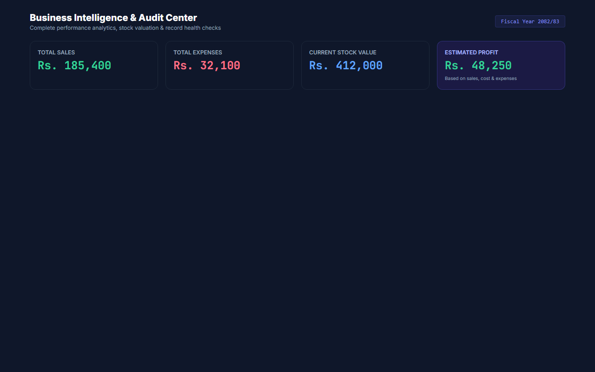
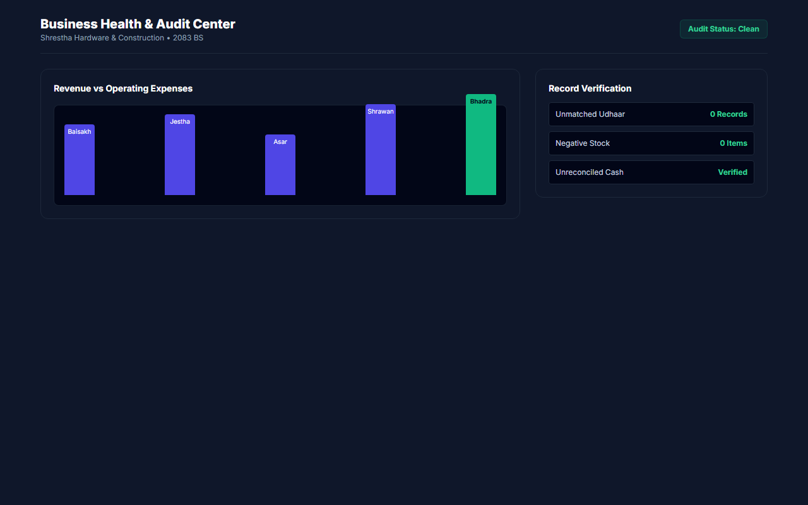
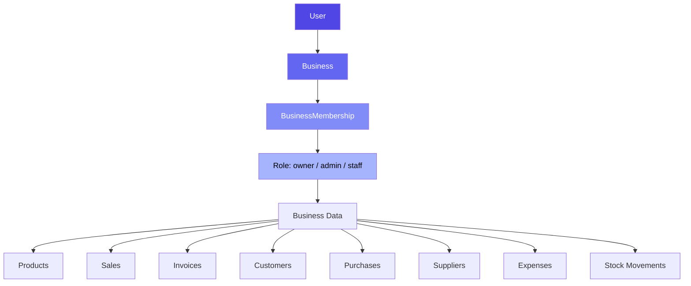
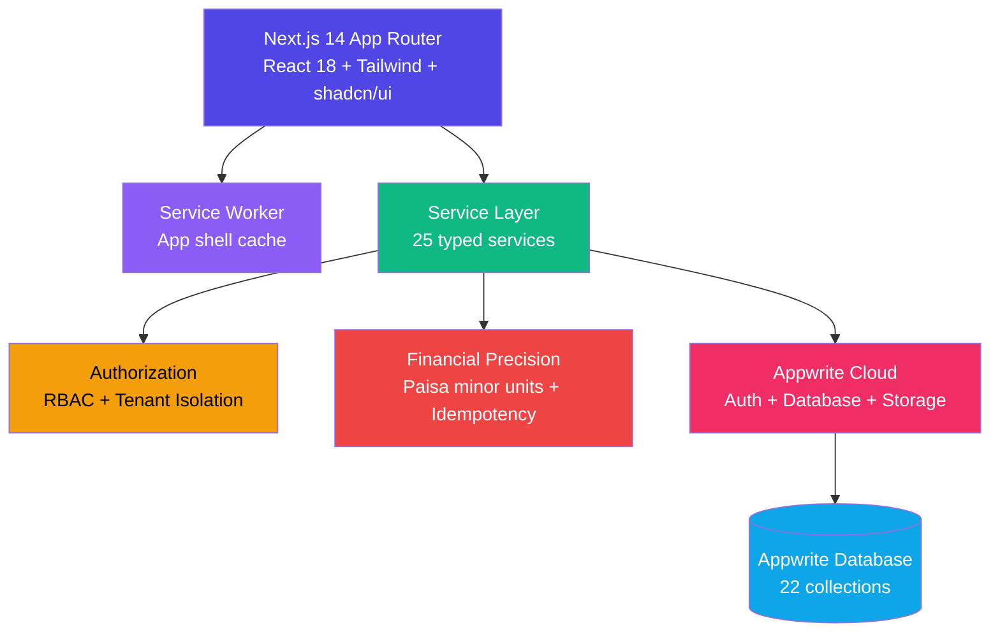
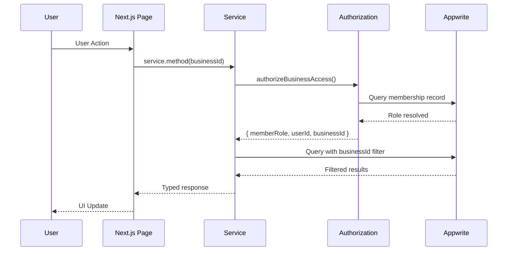
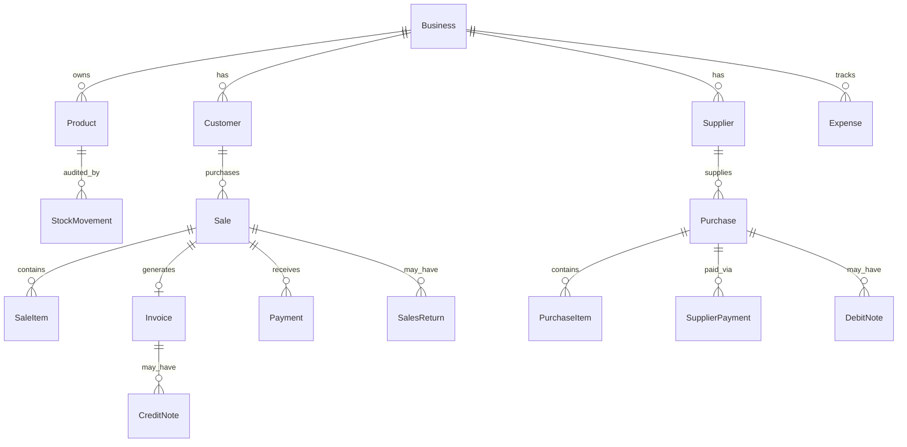

<div align="center">

# 📦 Inventory Lite

### Simple Inventory, POS Billing & Business Management for Small Businesses

> Manage products, stock, purchases, sales, customers, payments and business
> records from one lightweight application — built for small shops in Nepal.

[](https://nextjs.org/)
[](https://www.typescriptlang.org/)
[](https://appwrite.io/)
[](https://vitest.dev/)
[](https://playwright.dev/)
[](https://vercel.com/)

[🚀 Live Demo](https://inventory-lite-saa-s-0000.vercel.app/) · [📦 Repository](https://github.com/mohit282-cpu/Inventory-Lite-SaaS-0000) · [🐛 Issues](https://github.com/mohit282-cpu/Inventory-Lite-SaaS-0000/issues)

</div>

---

## 📑 Table of Contents

- [What Is Inventory Lite?](#-what-is-inventory-lite)
- [Who Is It For?](#-who-is-it-for)
- [Why Inventory Lite?](#-why-inventory-lite)
- [Screenshots](#-screenshots)
- [Complete Feature List](#-complete-feature-list)
- [Nepal-Focused Features](#-nepal-focused-features)
- [User Workflows](#-user-workflows)
- [Data Flow](#-data-flow)
- [Security](#-security)
- [Multi-Tenant Architecture](#-multi-tenant-architecture)
- [Offline Support](#-offline-support)
- [Architecture](#-architecture)
- [Technology Stack](#-technology-stack)
- [Data Model Overview](#-data-model-overview)
- [Project Structure](#-project-structure)
- [Getting Started](#-getting-started)
- [Environment Variables](#-environment-variables)
- [Appwrite Setup](#-appwrite-setup)
- [Local Development](#-local-development)
- [Testing](#-testing)
- [Production Build](#-production-build)
- [Deployment](#-deployment)
- [Limitations](#-limitations)
- [Production Readiness](#-production-readiness)
- [Future Roadmap](#-future-roadmap)
- [FAQ](#-faq)
- [Contributing](#-contributing)
- [License](#-license)
- [Support](#-support)

---

## 📸 Screenshots

| Dashboard | POS Billing | Products |
|:---------:|:-----------:|:--------:|
|  |  |  |

| Invoices | Stock Ledger | Customer Dues |
|:--------:|:------------:|:-------------:|
|  |  |  |

| Reports | Business Reports |
|:-------:|:----------------:|
|  |  |

> Try the interactive demo at [inventory-lite-saa-s-0000.vercel.app/demo](https://inventory-lite-saa-s-0000.vercel.app/demo) — no signup required.

---

## ❓ What Is Inventory Lite?

Inventory Lite is a **multi-tenant SaaS** that gives small shops everything they need to run their counter in one place: a product catalog, live stock levels, a fast point-of-sale billing screen, printable invoices, customer credit ledgers, supplier management, expenses, and business reports.

**For the shop owner 👨‍💼** — Replace paper bill pads, Excel sheets and notebook Udharo ledgers with one app. Record a sale in a few clicks, see instantly what's left on the shelf, know exactly who owes you what, and print a proper tax invoice with your PAN/VAT details.

**For the developer 👩‍💻** — Next.js 14 App Router + TypeScript strict mode on the frontend, Appwrite Cloud as the backend-as-a-service. Typed service layer with tenant isolation, idempotency protection, and financial precision utilities. 41 Vitest test suites covering security, concurrency and financial integrity.

**For the technical reviewer 🧐** — Every business record carries a `businessId`; every query is filtered by it; every read/update/delete re-verifies it (`src/services/base.service.ts`). Documents use per-user/team Appwrite permissions — never public access. The repo ships with dedicated audit docs and 41 unit/integration test suites including E2E flows.

---

## 🎯 Who Is It For?

| Business Type | Why It Helps |
|---|---|
| 🔧 Hardware shops | Track cement bags, wire rolls and fittings with SKU/barcode search and low-stock alerts |
| ⚡ Electrical shops | Fast counter billing with VAT-inclusive tax invoices |
| 🛒 Grocery & kirana stores | Quick POS entry with walk-in customers and cash/card payments |
| ✏️ Stationery shops | Simple catalog + categories for hundreds of small items |
| 🏬 Small retailers (general) | Customer credit (Udharo) ledger with partial payment tracking |
| 📱 Mobile-first vendors | Installable PWA that works on phones and tablets |

Built specifically around how small businesses in Nepal operate — NPR currency, PAN/VAT invoicing, Bikram Sambat dates and customer credit traditions.

---

## 💡 Why Inventory Lite?

| Principle | What It Means |
|---|---|
| **Simple** | Not an oversized ERP. Focused on what small shops actually need. |
| **Lightweight** | Fast page loads, minimal bundle, lazy-loaded charts and dialogs. |
| **Easy to learn** | Guided onboarding wizard, familiar billing workflow. |
| **Nepal-focused** | NPR currency, BS/AD dates, PAN/VAT, fiscal year, local payment methods. |
| **Inventory + billing focused** | Product management, stock tracking, POS, invoicing and credit — done well. |
| **Zero infrastructure cost** | Vercel free tier + Appwrite Cloud = no server costs to run. |

---

## 📋 Complete Feature List

### 📦 Core Inventory

| Feature | Description |
|---|---|
| Products | Full CRUD with name, SKU, barcode, purchase price, selling price, unit, image, category |
| SKU Auto-generation | Automatic unique SKU assignment per business |
| Barcode Support | Barcode/QR code scanning and lookup in POS |
| Categories | Product categorization with name and description |
| Stock Quantity | Real-time stock tracking per product |
| Low Stock Alerts | Configurable minimum stock threshold with alerts |
| Product Images | Image upload via Appwrite Storage buckets |
| Product Status | Active/inactive toggle for soft-delete |
| Search & Filter | Product search by name, SKU, or barcode; filter by category and status |

### 📥 Purchases

| Feature | Description |
|---|---|
| Purchase Orders | Create purchases linked to suppliers with line items |
| Supplier Invoice Number | Record the supplier's own invoice/bill number |
| Line Items | Per-item quantity, purchase price, discount, tax |
| Subtotal/Discount/Tax/Total | Full financial breakdown with paisa-level precision |
| Payment Tracking | Paid amount, due amount, payment method |
| Purchase History | Searchable and filterable purchase list |
| Stock IN | Automatic stock increment on purchase completion |
| Purchase Cancellation | Cancel purchases with stock reversal (owner/admin only) |
| Supplier Balance | Automatic outstanding payable update |

### 🧑‍💼 Suppliers

| Feature | Description |
|---|---|
| Supplier Directory | Create, edit, and archive suppliers |
| Contact Information | Name, phone, email, address |
| PAN/VAT Number | Combined tax registration field |
| Purchase History | View all purchases from a supplier |
| Outstanding Payable | Running balance of amounts owed (`outstandingPayable`) |
| Supplier Payments | Record payments with amount, method, date, reference |
| Supplier Ledger | Full chronological transaction history with running balance |
| Archive/Restore | Soft-delete and restore suppliers; hard delete blocked if financial history exists |

### 🛒 POS Billing

| Feature | Description |
|---|---|
| Product Search | Search by name in the POS catalog grid |
| Barcode/SKU Input | Scan or type barcode/SKU for quick product lookup |
| Cart Management | Add, remove, adjust quantity with +/- controls |
| Editable Unit Prices | Override selling price per line item (owner/admin only; staff blocked) |
| Per-line Discounts | Discount amount per cart item |
| Overall Discount | Rs. or percentage discount on the entire sale |
| VAT Toggle | Enable/disable 13% VAT per transaction |
| Payment Methods | Cash, bank transfer, card, Fonepay QR, credit (Udharo) |
| Walk-in Customers | Checkout without assigning a customer |
| Credit Sales | Assign customer and create due amount |
| Invoice Generation | Auto-numbered invoice created on sale completion |
| Receipt Printing | Print-optimized layout for POS receipts |

### 🧾 Invoices

| Feature | Description |
|---|---|
| Sequential Numbering | FY-based invoice numbers (e.g. `INV-83/84-000001`) |
| Invoice Detail | Customer info, line items, totals, payment status |
| A4 Tax Invoice | Full-page tax invoice layout with business details |
| Thermal Receipt | 80mm/58mm thermal receipt format for POS printers |
| Print Support | `window.print()` with print-optimized CSS |
| BS Date Display | Bilingual BS + AD dates on invoices |
| Invoice History | Searchable list of all invoices |
| Financial Year Reset | Numbering resets per Nepal fiscal year |

### 🔄 Sales Returns

| Feature | Description |
|---|---|
| Return Processing | Full or partial returns against original sale |
| Item Selection | Select specific items and quantities to return |
| Return Quantity Validation | Cannot return more than originally sold (minus prior returns) |
| Stock Restoration | Automatic stock increment on return completion |
| Refund Methods | Cash, credit adjustment, bank transfer, digital wallet, other |
| Return Reason | Required text reason for each return |
| Financial Adjustment | Subtotal, discount, tax, total calculated for return |
| Return History | Searchable list of all returns with sequential numbering (`SR-83/84-000001`) |

### 📝 Credit Notes

| Feature | Description |
|---|---|
| Credit Note Number | Sequential FY-based numbering (`CN-{formattedNumber}`) |
| Linked to Invoice | References the original invoice and sale |
| Customer Association | Auto-populated from invoice |
| Reason | Required text reason for issuance |
| VAT Adjustment | Taxable amount and 13% VAT calculated |
| Customer Due Adjustment | Optional automatic reduction of customer outstanding |
| Audit Trail | Created by, timestamp, full record |

### 📝 Debit Notes

| Feature | Description |
|---|---|
| Debit Note Number | Sequential FY-based numbering (`DN-{formattedNumber}`) |
| Linked to Purchase | References the original purchase |
| Supplier Association | Auto-populated from purchase |
| Reason | Required text reason for issuance |
| VAT Adjustment | Taxable amount and 13% VAT calculated |
| Supplier Balance Adjustment | Optional automatic reduction of supplier outstanding |
| Audit Trail | Created by, timestamp, full record |

### 👥 Customers

| Feature | Description |
|---|---|
| Customer Directory | Create and manage customer records |
| Contact Details | Name, phone, email, address |
| Purchase History | View all sales linked to a customer |
| Outstanding Balance | Running `totalDue` field |
| Customer Detail Page | Full customer view with transactions |
| Walk-in Support | Sales can proceed without a customer record |

### 🤝 Udharo (Customer Credit)

| Feature | Description |
|---|---|
| Credit Ledger | Dedicated page showing all customers with outstanding dues |
| Status Filters | UNPAID, PARTIAL, OVERDUE, PAID, ALL |
| Customer Filter | Filter by specific customer |
| Summary KPIs | Total credit due, customers with credit, overdue amount, payments this month |
| Record Payment | Dialog to record partial or full payment against due |
| Payment Edit/Delete | Modify or remove previously recorded payments |
| Auto-filled Remaining | When recording payment, remaining due auto-calculated |
| Overdue Detection | Uses `dueDate` or 30-day default from `createdAt` |

### 💳 Payments

| Feature | Description |
|---|---|
| Cash | Standard cash payment |
| Bank Transfer | Bank/wire transfer recording |
| Card | Card payment recording |
| Fonepay QR | Fonepay digital payment |
| Credit | Udharo/credit payment (creates due amount) |
| Payment History | Full payment records per sale |
| Payment Status | POSTED, VOIDED, REVERSED, REFUNDED |
| Payment Reversal | Non-destructive reversal — marks original as VOIDED, creates compensating entry |

### 💸 Expenses

| Feature | Description |
|---|---|
| Expense Logging | Title, category, description, amount, date, notes |
| Categories | Rent, utilities, salaries, supplies, transport, maintenance, other |
| Date Filters | Filter expenses by date range |
| Today/Month KPIs | Today's expenses, this month's total, all-time total |
| Expense History | Searchable list of all expenses |

### 📊 Reports

| Feature | Description |
|---|---|
| Sales Register | Filterable table of all sales with search, status filter, totals |
| Purchase Register | Filterable table of all purchases with supplier, totals |
| Tax/VAT Summary | Output VAT (sales), Input VAT (purchases), credit/debit note adjustments, net VAT position |
| Product & Stock Valuation | Inventory value at cost and retail, margin calculations |
| Customer Dues Report | Outstanding balances by customer |
| Expense Report | Expense breakdown by category |
| Executive Summary | Revenue, COGS, gross/net profit, margin percentage |
| Monthly Financial Summary | Grouped bar chart: Revenue, Expenses, Net Profit per month |
| Sales & Payment Reconciliation | Gross sales, discounts, VAT, net billed, collections, outstanding |
| Audit Health | 7 automated data quality checks (invoice sequence, duplicates, payment variance) |
| Business Health Audit | Bilingual (EN/NE) analysis with severity levels and action steps |
| Financial Year Selector | BS fiscal year filtering for all reports |
| Two View Modes | Simple (shop owner) and Accountant (detailed) views |
| Year-End Review Checklist | Interactive 8-item checklist with localStorage persistence |

### 📈 Dashboard

| Feature | Description |
|---|---|
| KPI Cards | Today's sales, monthly sales, outstanding dues, low/out-of-stock counts |
| Sales Trend Chart | 7-day area chart with gradient fill (Recharts) |
| Payment Methods Chart | Donut/pie chart showing Cash/Card/Credit breakdown |
| Top Products Chart | Horizontal bar chart of top-selling products by revenue |
| Progressive Loading | Critical KPIs load first, charts load in background |

### 📚 Stock Movement

| Feature | Description |
|---|---|
| Stock IN | Manual stock addition with reason |
| Stock OUT | Manual stock removal with reason |
| Stock Adjustment | Correct stock quantity with reason |
| Movement History | Full audit trail with date/time, type, product, quantities |
| Previous/New Quantity | Each movement records before and after stock levels |
| Reference Links | Movements linked to sales, purchases, or returns |
| Date Presets | Today, Yesterday, This Week, This Month, Last Month, All, Custom |
| PDF Export | A4 Landscape stock ledger PDF with 9 columns |

### 📊 Export & PDF

| Feature | Description |
|---|---|
| CSV Export | Sales, invoices, expenses with proper escaping |
| Excel Export | 9-sheet workbook: Executive Summary, Monthly Summary, Sales Register, Invoice Register, Payment Reconciliation, Receivables, Inventory, Expenses, Cancelled Transactions |
| PDF Export | Stock ledger PDF (A4 Landscape, 9 columns), Business Intelligence PDF (Executive Summary, Sales Register, Payment Reconciliation) |
| Audit Pack (ZIP) | Bundles Excel + PDF into a single ZIP download |
| Print | Browser print with thermal (58mm/80mm) and A4 layouts |
| Full Data Export | JSON export of all business data (products, sales, invoices, etc.) |

### 👤 Staff & RBAC

| Feature | Description |
|---|---|
| Owner | Full access including business deletion and role changes |
| Admin | Full operational access except business deletion |
| Staff | Day-to-day operations: POS, stock reading, customer reading, creating sales/payments |
| Permission Matrix | 22 permissions documented per role, enforced at service layer |
| Team Settings | View and manage team members (owner/admin only) |

### 📱 PWA & Demo

| Feature | Description |
|---|---|
| Installable PWA | manifest.json + service worker for home screen install |
| App Shell Caching | Service worker pre-caches static assets |
| Offline Detection | Amber banner when connection is lost |
| Interactive Demo | Full POS, Inventory, and Khata demo without signup |
| Thermal Receipt Demo | 58mm/80mm receipt preview with print support |

---

### ✅ Feature Status Matrix

| Feature | Status |
|---|---|
| Products | ✅ |
| Categories | ✅ |
| Purchases | ✅ |
| Suppliers | ✅ |
| Stock Management | ✅ |
| POS Billing | ✅ |
| Invoices | ✅ |
| Sales Returns | ✅ |
| Bill Cancel/Void | ✅ |
| Credit Notes | ✅ |
| Debit Notes | ✅ |
| Customers | ✅ |
| Udhaara | ✅ |
| Payments | ✅ |
| Expenses | ✅ |
| Reports | ✅ |
| COGS/Profit | ✅ |
| Stock Movement | ✅ |
| Staff/RBAC | ✅ |
| BS/AD Dates | ✅ |
| NPR Currency | ✅ |
| PAN/VAT | ✅ |
| Fiscal Year | ✅ |
| Sequential Numbering | ✅ |
| Sales Register | ✅ |
| Purchase Register | ✅ |
| Tax/VAT Summary | ✅ |
| Data Export | ✅ |
| PDF Export | ✅ |
| Authentication | ✅ |
| Tenant Isolation | ✅ |
| Audit Trail | ✅ |
| Invoice Immutability | ✅ |
| Financial Reversal | ✅ |
| Idempotency | ✅ |
| CAS Stock Locks | ✅ |
| PWA | ✅ |
| Offline Data Sync | ❌ |
| CI/CD Pipeline | ❌ |
| LICENSE | ❌ |

---

## 🇳🇵 Nepal-Focused Features

### NPR Currency

Nepalese Rupee formatting with `Rs.` / `रु.` prefix and **Lakhs & Crores grouping** (e.g. `रु. 1,50,000.00`). Used throughout invoices, receipts, reports and dashboards.

### Bikram Sambat (BS) Dates

Offline BS ↔ AD conversion engine supporting **years 2000–2090 BS**. Bilingual date display (English and Nepali). BS date picker component. Used in all date displays, invoices and reports. Nepal timezone (`Asia/Kathmandu`, +05:45) aware.

### PAN / VAT

Business PAN and VAT registration fields on the business profile. PAN/VAT numbers printed on invoice headers. **13% VAT calculation** on sales and purchases. VAT can be toggled on/off per transaction. Tax registration type auto-detected from PAN/VAT presence.

### Fiscal Year

Nepal fiscal year starting on **Shrawan 1st** (BS Month 4, approximately mid-July AD). Document numbers labeled per fiscal year (e.g. `2083/84`). Sequential numbering resets each fiscal year. Five fiscal years available in the selector.

### Invoice Numbering

Sequential FY-based numbering for all document types:
- Sales: `SALE-83/84-000001`
- Invoices: `INV-83/84-000001`
- Purchases: `PUR-83/84-000001`
- Sales Returns: `SR-83/84-000001`
- Credit Notes: `CN-{formattedNumber}`
- Debit Notes: `DN-{formattedNumber}`

### Tax Records

Sales register, purchase register, and tax/VAT summary reports designed for Nepal tax record-keeping. The Tax/VAT Summary shows Output VAT (sales) vs Input VAT (purchases) with credit/debit note adjustments and net VAT position. Includes a system-generated disclaimer that this does not constitute an official IRD filing.

### Nepali Localization

- Nepali numeral conversion (`0` → `०`, `1` → `१`, etc.)
- Nepali phone validation (mobile 98/97 prefix, landline 01 prefix)
- PAN validation (exactly 9 digits)
- Bilingual financial term glossary (English + Nepali)
- Nepali font (Noto Sans Devanagari) included
- 2-language i18n system (English / Nepali)

> **Important:** Inventory Lite is designed with Nepal-focused billing and record-keeping features. It is **not** IRD Approved, IRD Certified, or Government Approved. It does not claim CBMS integration. Actual government compliance depends on applicable requirements and official approval.

---

## 🔄 User Workflows

### Purchase Workflow

```
Supplier → Create Purchase → Add Items (qty, cost, discount, tax)
   → Stock IN (automatic) → Update Product Cost Price
   → Payment (paid/due split) → Update Supplier Balance
   → Purchase Register Entry
```

### Sales Workflow

```
Customer (or Walk-in) → POS Counter → Search/Scan Product
   → Add to Cart (qty, price override, discount)
   → Select Payment Method (cash/card/bank/credit)
   → VAT Toggle (13% or 0%)
   → Complete Sale → Server-side Price Verification
   → Financial Recalculation → Stock OUT (automatic)
   → Invoice Generated → Customer Due Updated (if credit)
   → Receipt Ready (A4 or Thermal)
```

### Return Workflow

```
Original Sale → Sales Return Dialog → Select Items & Quantities
   → Return Quantity Validation (≤ original - prior returns)
   → Stock IN (automatic) → Customer Due Adjustment (if credit sale)
   → Refund Method (cash/credit/bank/digital/other)
   → Return Record Created
```

### Expense Workflow

```
Record Expense → Category (rent/utilities/salaries/supplies/transport/maintenance/other)
   → Amount & Date → Expense Register Updated
   → Reports Reflect Expense → Net Profit Adjusted
```

### Supplier Payment Workflow

```
Supplier with Due → Record Payment → Amount & Method
   → Supplier Balance Decreased → Supplier Ledger Updated
   → Payment History Recorded
```

### Credit/Udhaara Workflow

```
Credit Sale → Customer Due Increased → Udhaar Ledger Updated
   → Record Partial/Full Payment → Due Decreased
   → Status: UNPAID → PARTIAL → PAID (or OVERDUE if past due date)
```

---

## 📊 Data Flow

### Sale Transaction

```
Product (stock check) → Sale Record → Sale Items (snapshots)
   → Stock Movement (stock_out) → Payment Record
   → Customer Due (if credit) → Invoice (auto-numbered)
   → Reports (sales, profit, tax, dashboard)
```

### Purchase Transaction

```
Supplier → Purchase Record → Purchase Items (snapshots)
   → Stock Movement (stock_in) → Product Cost Updated
   → Supplier Payment (if paid) → Supplier Balance Updated
   → Purchase Register Entry
```

### Sales Return

```
Original Sale → Return Record → Return Items
   → Stock Movement (stock_in) → Customer Due Adjusted
   → Financial Adjustment → Return Register Entry
```

### Invoice Generation

```
Sale Completed → Invoice Created (sequential FY number)
   → Invoice Number Verified (uniqueness check)
   → Idempotency Record (prevents duplicates)
   → Invoice Available for Print/Export
```

---

## 🔐 Security

### Authentication

- Email/password signup with password strength meter
- Login with session management
- Forgot/reset password flow with email
- Email verification with resend cooldown
- Account status tracking (ACTIVE/BLOCKED)
- Auth timeout protection (10s bootstrap timeout)

### Role-Based Access Control (RBAC)

Three-tier role hierarchy enforced at the service layer:

| Role | Permissions |
|---|---|
| **Owner** | Full access: business CRUD, member management, all data CRUD, reports, settings, business deletion |
| **Admin** | Everything except `business:delete` |
| **Staff** | Read products/stock/customers, create/read sales, create/read payments, read invoices |

Every service call goes through `authorizeBusinessAccess()` which:
1. Validates user authentication (non-empty userId)
2. Blocks client code from passing `businessId = 'system'`
3. Resolves the caller's real role from the **database membership record** (never trusts client input)
4. Checks required role against resolved role, throws `ForbiddenError` on mismatch
5. Auto-heals missing owner membership records

### Tenant Isolation

Three-layer isolation:

| Layer | Enforcement |
|---|---|
| **Database** | Per-document Appwrite permissions — no public access to business data |
| **Service** | `BaseService` auto-injects `businessId` filters on every query, re-verifies ownership on every get/update/delete, blocks `businessId` mutation |
| **Application** | RBAC role checks via `authorizeBusinessAccess()` before privileged operations |

### Financial Protection

- **Idempotency keys** — 5-layer protection: in-memory lock, Appwrite persistent store, application check, atomic reservation, operation execution. Prevents duplicate financial transactions across retries, tabs and serverless processes.
- **CAS stock locks** — Compare-And-Swap atomic stock updates with distributed locking via `inventory_locks` collection. Retries up to 10 times on conflict.
- **Financial invariant validation** — `validateFinancialInvariants()` ensures: `paid ≤ total`, `due = total - paid`, no negative amounts, no simultaneous due + change.
- **Server-side price verification** — Sale prices fetched from DB, not trusted from client. Staff price overrides blocked; owner/admin overrides audit-logged.
- **Invoice immutability** — Sale items snapshotted at time of sale (product names, prices frozen). Stock movement records are immutable (update/delete methods throw errors).
- **Payment reversal tracking** — Payments are never hard-deleted; they are VOIDED and a compensating reversal entry is created.

### Security Headers

Configured in `next.config.js`:

| Header | Value |
|---|---|
| `Strict-Transport-Security` | `max-age=63072000; includeSubDomains; preload` |
| `X-Frame-Options` | `DENY` |
| `X-Content-Type-Options` | `nosniff` |
| `Referrer-Policy` | `strict-origin-when-cross-origin` |
| `Permissions-Policy` | `camera=(), microphone=(), geolocation=()` |
| `Content-Security-Policy` | Restricted origins (self, Appwrite, Vercel Insights) |

### Input Validation

All user inputs validated with Zod schemas (`src/lib/validations.ts`). Financial values validated for NaN, Infinity, negative amounts. File upload validation checks extensions, MIME types, magic bytes and path traversal.

### Error Handling

Structured error taxonomy: `AppError`, `ValidationError`, `AuthenticationError`, `AuthorizationError`, `NotFoundError`, `ConflictError`, `NetworkError`. Automated classification into 10 error categories. User-friendly messages with technical details logged for debugging.

---

## 🏢 Multi-Tenant Architecture



Every business record carries a `businessId` field. Every query is filtered by it. Every read/update/delete re-verifies it.

**Key enforcement points:**
- `src/services/base.service.ts` — Automatic `businessId` injection on all queries
- `src/lib/authorization.ts` — `authorizeBusinessAccess()` resolves role from database
- `src/lib/security.ts` — `validateTenantAccess()`, `buildAppwritePermissions()` (never `Role.any()`)

---

## 📴 Offline Support

### What Works Offline

| Capability | How |
|---|---|
| **App shell** | Service Worker (`public/sw.js`) pre-caches static assets (manifest, icons, root page) |
| **Static assets** | Cache-first with background network update (stale-while-revalidate) |
| **Offline detection** | Amber banner displayed when `navigator.onLine` is false |
| **BS/AD calendar** | 100% offline date conversion engine (no network required) |
| **Previously visited pages** | Served from cache when offline |

### What Does NOT Work Offline

| Limitation | Reason |
|---|---|
| **No offline data entry** | No IndexedDB/Dexie layer for local data persistence in production code |
| **No offline sales** | All writes require active Appwrite connection |
| **No sync queue** | No client-side data sync mechanism exists |
| **No conflict resolution** | No offline-to-online merge logic |

The service worker handles **app shell caching only**. It prevents the app from failing to load when offline but does not enable offline business operations.

---

## 🏗️ Architecture



### Request Flow



### Key Design Decisions

| Decision | Rationale |
|---|---|
| Appwrite as BaaS | Zero server infrastructure, built-in auth/database/storage |
| Typed service layer | Type safety from UI to database, easy to test |
| BaseService pattern | DRY — tenant isolation and CRUD in one place |
| Client-side rendering | Faster initial loads, offline shell resilience |
| Lazy-loaded charts | Smaller initial bundle, faster TTI |
| Financial precision (paisa) | Integer minor units eliminate floating-point errors |
| Immutable audit logs | Stock movements and financial records cannot be altered |

---

## 🧰 Technology Stack

| Layer | Technology |
|---|---|
| Framework | Next.js 14 (App Router) · React 18 · TypeScript 5 (strict) |
| Styling / UI | Tailwind CSS · shadcn/ui-style components on Radix primitives · Lucide icons |
| Forms & Validation | React Hook Form + Zod |
| Charts | Recharts (lazy-loaded via `next/dynamic`) |
| PDF Generation | jsPDF + jspdf-autotable |
| Excel Export | SheetJS (xlsx) |
| ZIP Bundling | JSZip |
| Backend | Appwrite Cloud (Auth, Databases, Storage) |
| Unit Testing | Vitest + Testing Library + fake-indexeddb |
| E2E Testing | Playwright (Chromium, Firefox, WebKit) |
| Deployment | Vercel (frontend) · GitHub (source control) |

---

## 📊 Data Model Overview

### Appwrite Collections (22)

| Collection | Purpose |
|---|---|
| `users` | Extended user profiles |
| `businesses` | Business (tenant root) entities |
| `business_members` | Membership & roles |
| `categories` | Product categories |
| `products` | Product inventory |
| `stock_movements` | Stock audit trail |
| `customers` | Customer directory |
| `sales` | Sales transactions |
| `sale_items` | Line-item snapshots |
| `invoices` | Generated invoices |
| `payments` | Payment records |
| `expenses` | Expense records |
| `financial_sequences` | FY-based document numbering |
| `inventory_locks` | Distributed locking for SKU/barcode uniqueness |
| `idempotency_keys` | Idempotency keys for financial writes |
| `suppliers` | Supplier/vendor directory |
| `purchases` | Purchase orders |
| `purchase_items` | Purchase line items |
| `supplier_payments` | Payments to suppliers |
| `sales_returns` | Sales return records |
| `sales_return_items` | Return line items |
| `credit_notes` | Credit notes issued to customers |
| `debit_notes` | Debit notes issued to suppliers |

### Storage Buckets (3)

| Bucket | Purpose |
|---|---|
| `product_images` | Product images |
| `business_logos` | Business logos |
| `documents` | General document uploads |

### Key Relationships



---

## 📂 Project Structure

```
Inventory-Lite-SaaS-0000/
├── e2e/                              # Playwright E2E specs
├── docs/                             # Architecture, security, deployment docs
│   ├── APPWRITE_SETUP.md
│   ├── DATABASE_SCHEMA.md
│   ├── DEPLOYMENT.md
│   ├── architecture/
│   ├── deployment/
│   └── security/
├── public/
│   ├── manifest.json                 # PWA manifest
│   ├── sw.js                         # Service worker
│   ├── icons/                        # PWA icons (192, 512, maskable, SVG)
│   └── screenshots/                  # App screenshots (8 images)
├── src/
│   ├── app/
│   │   ├── layout.tsx                # Root layout (fonts, providers)
│   │   ├── page.tsx                  # Landing page
│   │   ├── auth/                     # login · signup · forgot/reset · verify
│   │   ├── onboarding/               # 3-step business setup wizard
│   │   ├── api/                      # contact · subscribe endpoints
│   │   └── app/                      # Authenticated workspace
│   │       ├── layout.tsx            # App shell (sidebar, nav, offline banner)
│   │       ├── dashboard/            # KPIs & charts
│   │       ├── products/             # Product catalog CRUD
│   │       ├── categories/           # Category management
│   │       ├── stock/                # Stock ledger & movements
│   │       ├── sales/                # POS + sale history + receipts
│   │       ├── invoices/             # Invoice viewer (A4 / thermal)
│   │       ├── customers/            # Customer directory
│   │       ├── credit/               # Udharo (dues) ledger
│   │       ├── purchases/            # Purchase order management
│   │       ├── suppliers/            # Supplier directory
│   │       ├── expenses/             # Expense tracking
│   │       ├── calendar/             # Dual BS/AD calendar
│   │       ├── reports/              # Reports with export
│   │       └── settings/             # Profile · security · team · offline
│   ├── components/
│   │   ├── ui/                       # Base UI components (26 files)
│   │   ├── features/                 # Business feature components
│   │   │   ├── categories/           ├── credit/
│   │   │   ├── customers/            ├── expenses/
│   │   │   ├── invoices/             ├── products/
│   │   │   ├── purchases/            ├── reports/ (21 components)
│   │   │   ├── sales/                ├── settings/
│   │   │   ├── stock/                └── suppliers/
│   │   ├── auth/                     # Auth guard, loading, error screens
│   │   ├── dashboard/                # Recharts dashboard components
│   │   ├── demo/                     # Interactive demo (POS, Inventory, Khata)
│   │   ├── landing/                  # Landing page sections (15+)
│   │   ├── layout/                   # Sidebar, top-nav, mobile-nav
│   │   └── pwa/                      # SW register, install prompt
│   ├── services/                     # 25 typed Appwrite services
│   ├── lib/                          # Utilities, validations, exports
│   │   ├── money.ts                  # Financial precision (paisa)
│   │   ├── validations.ts            # Zod schemas
│   │   ├── authorization.ts          # RBAC matrix
│   │   ├── idempotency.ts            # 5-layer idempotency
│   │   ├── date/bs-date.ts           # BS↔AD engine
│   │   ├── export/                   # CSV, Excel, PDF
│   │   └── pdf/                      # Stock ledger PDF
│   ├── hooks/                        # use-auth, use-debounce, usePWAInstall
│   ├── context/                      # auth-context, language-context
│   ├── config/                       # appwrite.ts, i18n.ts
│   ├── types/                        # TypeScript definitions
│   └── test/                         # 41 Vitest test suites
├── .env.example
├── next.config.js
├── tailwind.config.ts
├── tsconfig.json
├── vitest.config.mts
├── playwright.config.ts
├── package.json
└── AGENTS.md
```

---

## ⚡ Getting Started

### Prerequisites

- **Node.js**: v18.17+ or v20+
- **npm**: v9+
- **Appwrite Project**: Free account on [cloud.appwrite.io](https://cloud.appwrite.io) (or self-hosted)

### 1. Clone & Install

```bash
git clone https://github.com/mohit282-cpu/Inventory-Lite-SaaS-0000.git
cd Inventory-Lite-SaaS-0000
npm install
```

### 2. Configure Environment

```bash
cp .env.example .env.local
```

Edit `.env.local` with your Appwrite credentials (see [Environment Variables](#-environment-variables)).

### 3. Set Up Appwrite

See [Appwrite Setup](#-appwrite-setup) for detailed instructions.

### 4. Run Locally

```bash
npm run dev
# → http://localhost:3000
```

Sign up, complete the onboarding wizard, and start adding products.

---

## 🔧 Environment Variables

### Public (client-safe)

| Variable | Required | Description |
|---|---|---|
| `NEXT_PUBLIC_APPWRITE_ENDPOINT` | Yes | Appwrite API endpoint (e.g. `https://cloud.appwrite.io/v1`) |
| `NEXT_PUBLIC_APPWRITE_PROJECT_ID` | Yes | Your Appwrite project ID |
| `NEXT_PUBLIC_APPWRITE_DATABASE_ID` | No | Database ID — defaults to `inventory_lite_db` if unset |

### Server-Only (never exposed to client)

| Variable | Required | Description |
|---|---|---|
| `APPWRITE_API_KEY` | Provisioning only | Admin API key for setup scripts — not needed at runtime |
| `NODE_ENV` | No | Defaults to `development` |

> ⚠️ `.env.local` contains project credentials — never commit it. Only `NEXT_PUBLIC_` variables reach the browser. The `APPWRITE_API_KEY` must **never** have a `NEXT_PUBLIC_` prefix.

---

## 🗄️ Appwrite Setup

### Option A — Manual Console Setup

1. Create a free account at [cloud.appwrite.io](https://cloud.appwrite.io)
2. Create a new project
3. Add a **Web Platform** with your domain (e.g. `localhost:3000` for dev, your Vercel domain for production)
4. Enable **Email/Password** authentication in Auth settings
5. Create database `inventory_lite_db`
6. Create the 22 collections listed in [Data Model Overview](#-data-model-overview)
7. Configure attributes and indexes per [DATABASE_SCHEMA.md](docs/DATABASE_SCHEMA.md)
8. Configure permissions per [PERMISSIONS.md](docs/security/PERMISSIONS.md)
9. Create 3 storage buckets: `product_images`, `business_logos`, `documents`

### Option B — Automated Provisioning

> **Note:** The automated setup script (`scripts/setup-appwrite.ts`) is referenced in documentation but does not currently exist in the repository. Manual setup via the Appwrite console is the current method.

### Collection Summary

| Collection | Key Attributes |
|---|---|
| `users` | name, email, phone, preferences (JSON) |
| `businesses` | name, ownerId, panNumber, vatNumber, taxRegistrationType, currency |
| `business_members` | businessId, userId, role (owner/admin/staff) |
| `products` | businessId, name, sku, barcode, purchasePrice, sellingPrice, stockQuantity |
| `sales` | businessId, customerId, saleNumber, total, paidAmount, dueAmount, status |
| `invoices` | businessId, saleId, invoiceNumber, issueDate |
| `purchases` | businessId, supplierId, purchaseNumber, total, paidAmount, dueAmount |
| `suppliers` | businessId, name, panVatNumber, totalPurchases, outstandingPayable |
| `customers` | businessId, name, phone, totalDue |
| `stock_movements` | businessId, productId, type, quantity, previousQuantity, newQuantity |
| `payments` | businessId, saleId, amount, paymentMethod, status |
| `expenses` | businessId, category, description, amount, date |
| `credit_notes` | businessId, creditNoteNumber, taxableAmount, vatAmount, totalAmount |
| `debit_notes` | businessId, debitNoteNumber, taxableAmount, vatAmount, totalAmount |
| `sales_returns` | businessId, returnNumber, saleId, totalAmount, reason, refundMethod |
| `financial_sequences` | businessId, documentType, financialYear, nextNumber |
| `idempotency_keys` | idempotencyKey, businessId, operationType, status |
| `inventory_locks` | Distributed locking for SKU/barcode uniqueness |

---

## 💻 Local Development

```bash
npm run dev
# → http://localhost:3000
```

### Development Commands

| Command | Purpose |
|---|---|
| `npm run dev` | Start Next.js development server |
| `npm run clean` | Remove `.next/` build cache |
| `npm run lint` | Run ESLint |
| `npm run typecheck` | TypeScript strict check (`tsc --noEmit`) |

### Development Notes

- TypeScript strict mode is enabled
- Service worker only registers in production (`NODE_ENV === 'production'`)
- Appwrite SDK warnings appear in dev mode if env vars are missing
- Charts and heavy dialogs are code-split via `next/dynamic` for performance

---

## 🧪 Testing

### Unit & Integration (Vitest — 41 suites)

Run in `jsdom` environment with `fake-indexeddb` for IndexedDB mocking.

| Category | Test Suites |
|---|---|
| 🔒 Security (5) | `security-comprehensive` · `security-rbac-tenant` · `p0-security` · `settings-rbac` · `tenant-isolation` |
| 💰 Financial (5) | `billing-calculation` · `vat-calculation-hardening` · `financial-integrity` · `financial-year-system` · `financial-year-numbering` |
| ⚡ Concurrency (2) | `concurrency-idempotency-hardening` · `inventory-concurrency` |
| 🧩 Business Modules (11) | `products-categories` · `customers` · `sales-pos` · `invoices` · `credit-udha` · `credit-notes` · `debit-notes` · `expenses` · `purchases-suppliers` · `sales-returns` · `bill-cancellation` |
| 📊 Reports & Audit (3) | `reports` · `reports-business-intelligence-audit` · `registers-tax` |
| 📚 Stock (2) | `stock-management` · `stock-ledger-pdf` |
| 🇳🇵 Localization (3) | `nepal-localization` · `nepali-calendar-system` · `bs-date-system` |
| 🏢 Business Logic (4) | `delete-business` · `onboarding-flow-step3` · `business-tax-registration` · `persistent-multi-device-business` |
| 🔐 Auth (2) | `auth-flow` · `auth-bootstrap-hang` |
| 📋 Other (4) | `cogs-profit` · `qa-edge-cases` · `qa-fixes-regression` · `utils` |

```bash
npm run test            # run once
npx vitest              # watch mode
```

### End-to-End (Playwright — 3 browsers)

| Spec | Scenario |
|---|---|
| `e2e/example.spec.ts` | Homepage load and navigation |
| `e2e/inventory-lite-flow.spec.ts` | Landing page navigation and auth route rendering |

```bash
npm run test:e2e        # auto-starts dev server on :3000
npx playwright install  # first time only — download browsers
```

### Quality Gate

```bash
npm run typecheck && npm run lint && npm run test && npm run build
```

---

## 🏗️ Production Build

```bash
npm run build
```

Build output includes:
- Optimized static pages (landing, auth, legal)
- Dynamic server-rendered pages (dashboard, POS, reports)
- Code-split chunks for charts, dialogs, PDF/Excel generation
- Service worker and PWA manifest

```bash
npm run start
# → serves production build on http://localhost:3000
```

---

## 🚀 Deployment

### Vercel (Recommended)

1. Push to the `main` branch on GitHub
2. Import the repository in [vercel.com](https://vercel.com) (framework auto-detected as Next.js)
3. Add environment variables in **Project → Settings → Environment Variables**:
   - `NEXT_PUBLIC_APPWRITE_ENDPOINT`
   - `NEXT_PUBLIC_APPWRITE_PROJECT_ID`
   - `NEXT_PUBLIC_APPWRITE_DATABASE_ID` (optional)
4. Deploy
5. Add your Vercel domain to Appwrite **Web Platforms**
6. Verify authentication, database connection and production build

### Deployment Flow

```
GitHub (main branch) → Vercel Build → Next.js Production → Appwrite Cloud
```

### Post-Deployment Checklist

- [ ] Environment variables configured in Vercel
- [ ] Appwrite Web Platform domain updated (add Vercel URL)
- [ ] Authentication working (signup + login)
- [ ] Database connection verified (create a test product)
- [ ] Storage buckets accessible (upload a product image)
- [ ] HTTPS enabled (Vercel default)
- [ ] Service worker registering (check DevTools → Application)

### CORS / Domain Troubleshooting

If authentication fails after deployment:
1. Check that your Vercel domain is added as a **Web Platform** in Appwrite console
2. Verify `NEXT_PUBLIC_APPWRITE_ENDPOINT` matches your Appwrite instance
3. Check browser console for CORS errors — the Appwrite domain allowlist must include your production URL

---

## ⚠️ Limitations

| Area | Status |
|---|---|
| **Offline data entry** | Service Worker caches app shell only; sales and writes require active connection. No IndexedDB/Dexie data sync layer. |
| **Staff invitations** | Invite dialog exists in settings but generates placeholder records — not wired to real accounts. |
| **Onboarding preferences** | Default VAT rate, invoice prefix collected in UI but not fully persisted. |
| **eSewa/Khalti** | Supported in `PaymentMethod` type but not exposed in POS UI. |
| **Invoice PDF** | Uses browser print dialog for individual invoices; server-generated PDFs exist for stock ledger and BI reports only. |
| **CI/CD** | No GitHub Actions or CI workflow configured. |
| **LICENSE** | No LICENSE file present — licensing terms TBD. |
| **Full ERP** | Not a full accounting system, not payroll software, not manufacturing software. |
| **IRD Compliance** | Not IRD Approved, IRD Certified, or Government Approved. Tax summaries are system-generated estimates. |

---

## ✅ Production Readiness

### Verified

- [x] TypeScript strict mode passes (`npm run typecheck`)
- [x] ESLint passes (`npm run lint`)
- [x] 41 unit/integration test suites pass (`npm run test`)
- [x] 2 E2E test suites pass (`npm run test:e2e`)
- [x] Production build passes (`npm run build`)
- [x] Security headers configured (HSTS, CSP, X-Frame-Options)
- [x] Environment variables documented
- [x] Tenant isolation enforced at 3 layers
- [x] RBAC enforced at service layer
- [x] Financial precision (paisa minor units)
- [x] Idempotency protection for financial writes
- [x] CAS stock locks for inventory concurrency
- [x] Immutable audit trail for stock movements
- [x] Non-destructive payment reversals
- [x] PWA with service worker

### Needs Work

- [ ] CI/CD pipeline (GitHub Actions)
- [ ] Offline data sync with conflict resolution
- [ ] Real staff invitation flow with email verification
- [ ] LICENSE file
- [ ] Rate limiting wired into production API routes
- [ ] Production audit log persistence (currently in-memory only)
- [ ] Data backup/restore procedures
- [ ] Monitoring and error tracking (e.g. Sentry)

---

## 🗺️ Future Roadmap

| Priority | Feature |
|---|---|
| High | Offline data sync with conflict resolution (IndexedDB/Dexie) |
| High | CI/CD pipeline (GitHub Actions) |
| High | Real staff invitation flow with email verification |
| Medium | eSewa/Khalti payment integration in POS UI |
| Medium | Camera-based barcode scanning |
| Medium | Multi-language invoice printing (Nepali/English) |
| Medium | Audit log viewer in settings |
| Medium | Rate limiting in production API routes |
| Low | Data backup and restore |
| Low | Multi-currency exchange rate support |
| Low | Real-time notifications (stock alerts, payment reminders) |
| Low | Advanced accounting features |

---

## ❓ FAQ

**What is Inventory Lite?**
A lightweight inventory and billing SaaS for small businesses in Nepal. It handles products, stock, POS billing, invoicing, customer credit, suppliers, expenses and reports.

**Who is it for?**
Retail shops, grocery stores, hardware shops, electronics shops, clothing shops, small wholesalers, and local businesses in Nepal.

**Does it support Nepalese Rupees?**
Yes. NPR currency with `Rs.` / `रु.` prefix and Lakhs & Crores grouping.

**Does it support BS dates?**
Yes. Bikram Sambat ↔ Gregorian conversion for years 2000–2090 BS, with bilingual display.

**Does it support PAN/VAT?**
Yes. 13% VAT calculation, PAN/VAT registration on business profile, printed on invoice headers.

**Does it support Udhaara?**
Yes. Dedicated credit ledger with UNPAID/PARTIAL/OVERDUE/PAID status, partial payment recording, and overdue detection.

**Does it work offline?**
Partially. The app shell loads offline via service worker, but all data operations (sales, purchases, stock) require an active internet connection.

**Does it support purchases?**
Yes. Full purchase orders with supplier selection, line items, stock intake, payment tracking and purchase cancellation.

**Does it support suppliers?**
Yes. Supplier directory with PAN/VAT, purchase history, outstanding payable, supplier payments and ledger.

**Can invoices be cancelled?**
Yes. Bills can be voided (not deleted) by owner/admin with a mandatory reason. Stock and due balances are reversed.

**Can invoices be deleted?**
No. Invoices and sales are never hard-deleted. They are cancelled/voided to preserve audit trail integrity.

**Does it support sales returns?**
Yes. Full or partial returns with quantity validation, stock restoration, refund method selection and return reason.

**Does it support credit/debit notes?**
Yes. Credit notes for customers, debit notes for suppliers, both with VAT adjustment and optional balance adjustment.

**Is it an ERP?**
No. It is a focused inventory, billing and business management tool — not a full ERP system.

**Is it IRD approved?**
No. It is designed with Nepal-focused billing features but is not IRD Approved, IRD Certified, or Government Approved. Tax summaries are system-generated estimates.

**Where is data stored?**
In your own Appwrite Cloud database. Each business is isolated via tenant IDs. No data is shared between businesses.

**How do I deploy it?**
Push to GitHub, import in Vercel, configure environment variables, add your domain to Appwrite. See [Deployment](#-deployment).

---

## 🤝 Contributing

1. Fork the repository and create a feature branch from `main`
2. Follow the coding standards in [AGENTS.md](AGENTS.md) — TypeScript strict, typed service layer, tenant isolation everywhere
3. Run the quality gate before opening a PR:
   ```bash
   npm run lint && npm run typecheck && npm run test && npm run build
   ```
4. Use conventional commit messages (`feat:`, `fix:`, `docs:`, `refactor:`, `test:`)
5. Open a pull request describing what changed and why

When touching anything data-related, double-check **tenant isolation** — every query must be scoped by `businessId`.

---

## 📄 License

License: Not currently specified. No LICENSE file is present in the repository. Licensing terms are TBD.

---

## 📞 Support

For support, please:
- Open an issue on [GitHub Issues](https://github.com/mohit282-cpu/Inventory-Lite-SaaS-0000/issues)
- Visit the [Contact Page](https://inventory-lite-saa-s-0000.vercel.app/contact) on the live application

---

## 📚 Documentation

| Document | Contents |
|---|---|
| [APPWRITE_SETUP.md](docs/APPWRITE_SETUP.md) | Step-by-step backend provisioning guide |
| [DATABASE_SCHEMA.md](docs/DATABASE_SCHEMA.md) | Every collection, attribute, index and permission |
| [PERMISSIONS.md](docs/security/PERMISSIONS.md) | Role hierarchy and operation-by-operation permission matrix |
| [TENANT_ISOLATION.md](docs/architecture/TENANT_ISOLATION.md) | How multi-tenant isolation is enforced and verified |
| [DEPLOYMENT.md](docs/DEPLOYMENT.md) | Pre-deploy gates and production release process |
| [ROLLBACK_RUNBOOK.md](docs/deployment/ROLLBACK_RUNBOOK.md) | Incident rollback procedure |
| [ZERO_COST_ARCHITECTURE.md](docs/architecture/ZERO_COST_ARCHITECTURE.md) | How the stack runs at zero infrastructure cost |
| [PRODUCTION_CONFIGURATION_CHECKLIST.md](docs/deployment/PRODUCTION_CONFIGURATION_CHECKLIST.md) | Pre-deployment checklist |
| [AGENTS.md](AGENTS.md) | Coding standards and contribution conventions |

---

<div align="center">

**Inventory Lite** — Spend less time managing records. More time running your shop.

<a href="https://inventory-lite-saa-s-0000.vercel.app/">Start Free →</a>

Made for small businesses in Nepal 🇳🇵

</div>
